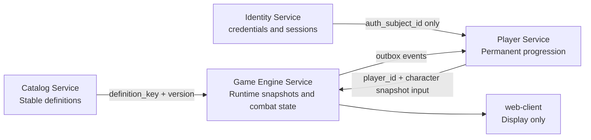

# data-model-0.1 — Gameplay Data Model Overview

Version: `data-model-0.1-rc2`

## Current status

This document set is the implementation reference candidate for data-model-0.1.
It must be reviewed and accepted before Game Engine alpha-0.7.x begins.

No Game Engine alpha-0.7.x implementation should start before data-model-0.1 is accepted.

This version is not final and is not accepted yet. It hardens the data model so the next implementation PRs can rely on a coherent target.

## Purpose

This document set defines the target gameplay data model for L'epopee des silences. It is the reference candidate for entity ownership, lifecycle, relational schemas, effects, modifiers, rewards, items, laws, curses, rare rooms, Markov readiness, ATB readiness, and future combat metrics.

## Core ownership rule

```text
Catalog owns stable definitions.
Player owns permanent player progression.
Game Engine owns runtime snapshots and combat state.
Frontend displays state and never owns gameplay truth.
```

Primary gameplay statistics are relational columns, not JSON. Runtime snapshots avoid cross-service reads and prevent Catalog or Player changes from unexpectedly changing an active run or combat. Cross-service links use stable keys, not cross-database foreign keys.

## Why data-model-0.1 exists

The project has playable runs, combat, skills, items, rewards, laws, curses, merchant flows, boss flows, and a player service. The data model grew organically and now needs a formal contract before the data-driven backend work starts.

This rc2 pass resolves the main ambiguities:

- EffectSet is the canonical Catalog effect source.
- Catalog room definitions are first-class, including rare rooms and cultural echo rooms.
- Combatants separate identity, immutable base stat snapshots, and mutable runtime state.
- RunItems snapshot enough Catalog data to remain stable during a run.
- Markov belongs to alpha-0.7.x readiness and integration, not alpha-0.9.x.
- Runtime Markov/Palace projections are qualitative and do not expose internal matrices.
- Official combat metrics are prepared as relational backend data, while current frontend meters remain non-authoritative.

## Non-goals

- No backend code changes.
- No frontend code changes.
- No EF migrations.
- No Domain entity changes.
- No DTO changes.
- No service changes.
- No new feature implementation.
- No Markov implementation.
- No ATB implementation.
- No rare room implementation.
- No endpoint changes.

## Service separation



### Catalog owns definitions

Catalog owns durable, versioned, stable gameplay definitions:

- enemy definitions and stat blocks;
- skill definitions;
- item definitions;
- EffectSets and EffectDefinitions;
- palace law definitions;
- curse definitions;
- reward templates and options;
- room definitions, rare rooms, cultural echo rooms, anomaly rooms, boss definitions;
- enemy, reward, law, curse, and room pools;
- Markov/adaptive metadata.

Catalog never owns runtime state.

### Player owns permanent progression

Player owns durable per-player data:

- player profile;
- optional auth subject link;
- player characters;
- permanent stat blocks;
- unlocked skills;
- permanent unlocks;
- projected run statistics.

Player never owns active combat runtime state.

### Game Engine owns runtime

Game Engine owns run-scoped and combat-scoped state:

- run state;
- room instances and map nodes;
- run player/character snapshots;
- run inventory item snapshots;
- run modifiers, active laws, active curses;
- combat identity, immutable combatant base snapshots, mutable combatant runtime states;
- combat actions and future official combat metrics;
- runtime Markov/adaptive influence traces and Palace indicator snapshots;
- reward offers and reward options;
- outbox messages.

Game Engine snapshots what it needs. It does not rely on live Catalog or Player reads while resolving active gameplay.

### Frontend displays state only

The frontend can compute temporary display affordances such as local meters or animation feedback, but it never owns gameplay truth. Backend snapshots, actions, and future metrics are authoritative.

## Lifecycle concepts

| Concept | Owner | Lifecycle | Example |
|---------|-------|-----------|---------|
| Definition | Catalog | Durable, versioned, global | `enemy.threshold.doubt-fragment` |
| Permanent state | Player | Durable, per-player | `PlayerCharacterStatBlock.max_vitality` |
| Run snapshot | Game Engine | Durable during run | `run_character_stat_snapshots` |
| Combat base snapshot | Game Engine | Immutable during combat | `run_combatant_base_stat_snapshots` |
| Combat runtime state | Game Engine | Mutable during combat | `run_combatant_runtime_states.current_vitality` |
| Runtime item snapshot | Game Engine | Stable during run | `run_inventory_items.definition_version` |
| Display-only state | Frontend | Ephemeral | local hover target, local meter animation |

## Naming conventions

- Catalog definition tables use `*_definitions`.
- Runtime Game Engine tables use `run_*`.
- Keys use dot notation in domain examples, for example `item.consumable.eclat-de-garde`.
- SQL table names use snake_case.
- DTO and type names use PascalCase.
- Enum values use PascalCase.
- Use `targeting_mode` consistently for Catalog definitions.
- Use `targeting_type` only when matching current DTO/contract names during migration.
- Use `RewardOption` for options within a reward offer; avoid mixing with `RewardChoice` except for legacy code references.
- Use `run_inventory_items` as the target table name; `run_items` is legacy/current-state naming.
- Use `starting_guard` for immutable/base start-of-combat guard and `current_guard` for mutable combat guard.
- Use `base_guard` only as legacy/current implementation terminology.
- Use `eclat-de-garde`, not `ecart-de-garde`.

## Document index

| Document | Content |
|----------|---------|
| [ADR-006](../adr/ADR-006-gameplay-entity-ownership-and-relational-schema.md) | Decision record for gameplay ownership and relational schema |
| [01 — Service ownership and lifecycle](01-service-ownership-and-lifecycle.md) | Ownership, lifecycle, snapshots, Identity relationship, RunItem snapshot rules |
| [02 — Combat stat taxonomy](02-combat-stat-taxonomy.md) | Canonical stats and lifecycle ownership |
| [03 — Effect, modifier, and duration model](03-effect-modifier-and-duration-model.md) | EffectSet, EffectDefinition, durations, behavior/generation effects |
| [04 — Catalog relational schema](04-catalog-relational-schema.md) | Catalog definitions, rooms, pools, EffectSet source of truth |
| [05 — Player relational schema](05-player-relational-schema.md) | Player profile, Identity link, permanent progression |
| [06 — Game Engine runtime schema](06-game-engine-runtime-schema.md) | Run/combat snapshots, runtime state, metrics, Markov projections |
| [07 — Reward, item, law, curse model](07-reward-item-law-curse-model.md) | Reward/item/law/curse flow and RunItem snapshot behavior |
| [08 — ATB readiness model](08-atb-readiness-model.md) | Schema-ready ATB fields, not behaviorally active |
| [09 — Markov readiness model](09-markov-readiness-model.md) | Catalog metadata and runtime qualitative projections |
| [10 — Migration roadmap](10-migration-roadmap-from-current-state.md) | Migration sequence from current state to data-model-0.1 |

## Target release positioning

```text
0.6.x
→ gameplay stabilization: items, combat, rewards, modifiers, merchant, boss, laws/curses MVP.

data-model-0.1.x
→ official gameplay data model.

web-client-0.5.x
→ UI direction, combat scene, map, besace, rewards, responsive layout.

game-engine/catalog/player 0.7.x
→ data-driven backend implementation + Markov system foundation.

0.8.x
→ ATB, Interlude, Him'Lit, long narrative loop depending on readiness.

0.9.x
→ identity, gateway, security, observability, external alpha readiness.
```

Markov readiness and Markov/adaptive selection integration belong to alpha-0.7.x after the data model and core data-driven schemas are accepted. Security, exposure, gateway, and external alpha readiness belong to alpha-0.9.x.

## Acceptance gate

data-model-0.1 can move from rc2 to Accepted only when all documents are internally consistent and the acceptance criteria in `10-migration-roadmap-from-current-state.md` are satisfied.
