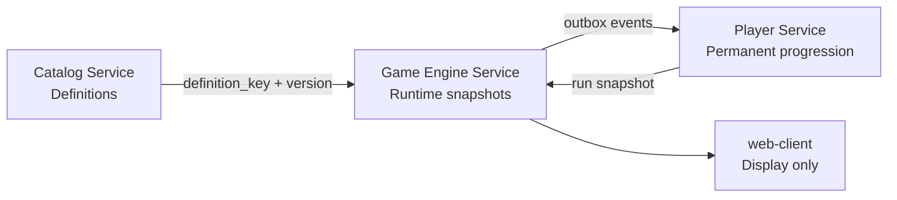

# data-model-0.1 — Gameplay Data Model Overview

## Purpose

This document defines the official gameplay data model for L'épopée des silences. It serves as the single source of truth for entity definitions, stat taxonomy, service ownership, relational schema, and design decisions before any new implementation.

## Why data-model-0.1 exists

The project has reached a functional alpha with playable runs, combat, skills, items, rewards, laws, curses, and a player service. The data model has grown organically. This specification formalizes what exists, resolves inconsistencies, and prepares for future systems (ATB, Markov-driven adaptive selection).

## The problem today

- Stats are scattered across domain entities with inconsistent naming (`Attack` vs `Strength` vs `Power`).
- No formal effect/modifier taxonomy exists.
- Primary collections are stored as JSON text rather than relational tables.
- No clear distinction between Catalog definitions, Player permanent state, and Game Engine runtime state.
- ATB and Markov readiness require fields that do not yet exist in the schema.

## Objectives

- Define all gameplay entities and their ownership by service.
- Define the official combat stat taxonomy with types, ranges, and ownership.
- Define the effect/modifier/duration model.
- Define relational schemas for Catalog, Player, and Game Engine.
- Prepare ATB-ready fields in the schema.
- Prepare Markov/adaptive-selection-ready metadata fields.
- Provide a migration roadmap from the current state.

## Non-objectifs

- This PR does not implement any code changes.
- This PR does not create EF migrations.
- This PR does not modify domain entities.
- This PR does not modify services.
- This PR does not modify the frontend.

## Service separation

### Catalog = definitions

Durable, versioned, stable, global. Catalog owns:

- Enemy definitions (stats, archetypes, skills, room compatibility)
- Skill definitions (type, targeting, cost, power)
- Item definitions (category, rarity, effects, usage mode)
- Palace law definitions (scope, effects, visibility)
- Curse definitions (severity, effects, trigger)
- Reward templates (options, scaling)
- Effect definitions (type, target scope, duration, value mode)
- Room boss definitions (room type, difficulty, tags)

### Player = permanent progression

Durable, per-player, evolves between runs. Player owns:

- Player profile (display name, creation date)
- Player characters (definition key, permanent stats, skill keys)
- Player progression (run statistics: started, completed, failed, abandoned)
- Permanent unlock candidates (future: items/skills unlocked during runs, projected via outbox)

### Game Engine = runtime

Durable during run, snapshot-based, archivable after run. Game Engine owns:

- Run state (seed, status, current room, inventory, modifiers, laws, curses)
- Room state (type, theme, map nodes, boss profile)
- Combat state (combatants, turn order, actions, effects)
- Reward offers (choices, selection)
- Runtime snapshots (player stats, enemy stats, skill stats frozen at creation)
- Outbox messages (integration events to Player)

## Lifecycle concepts

| Concept | Owner | Lifecycle | Example |
|---------|-------|-----------|---------|
| Definition | Catalog | Durable, versioned, stable, global | `enemy.threshold.doubt-fragment` |
| Permanent state | Player | Durable, per-player, evolves between runs | PlayerCharacter.MaxVitality |
| Run snapshot | Game Engine | Durable during run, archivable after | RunCharacterStatSnapshot |
| Combat runtime | Game Engine | Ephemeral within combat, mutable | Combatant.CurrentVitality |
| Permanent unlock candidate | Player (via outbox) | Obtained during run, projected if validated | `player_permanent_unlocks` row |

## Key rules

1. **Catalog owns base definitions.** Player owns permanent player progression. Game Engine owns runtime snapshots and combat state.

2. **Primary stats are explicit columns.** Never JSON blobs for `max_vitality`, `attack_power`, `defense`, `speed`, etc.

3. **Snapshots freeze values at creation.** When combat starts, enemy stats are computed and stored. Catalog changes after combat creation do not affect the active combat.

4. **Inter-service references use keys.** `definition_key`, `player_id`, `character_id`, `run_id`. No cross-database foreign keys.

5. **Same concept, different lifecycle.** An `EnemyDefinition` in Catalog and a `RunCombatantStatSnapshot` in Game Engine represent the same enemy, but with different lifecycles and owners.

## Document index

| Document | Content |
|----------|---------|
| [ADR-006](../adr/ADR-006-gameplay-entity-ownership-and-relational-schema.md) | Decision record for entity ownership and relational schema |
| [01 — Service ownership and lifecycle](01-service-ownership-and-lifecycle.md) | Entity ownership, lifecycle rules, snapshot rules |
| [02 — Combat stat taxonomy](02-combat-stat-taxonomy.md) | Official stat definitions, types, ranges, ownership |
| [03 — Effect, modifier, and duration model](03-effect-modifier-and-duration-model.md) | EffectType, EffectTargetScope, EffectDuration, StackPolicy, ValueMode |
| [04 — Catalog relational schema](04-catalog-relational-schema.md) | Tables, columns, types, indexes, relations for Catalog |
| [05 — Player relational schema](05-player-relational-schema.md) | Tables, columns, types, indexes, relations for Player |
| [06 — Game Engine runtime schema](06-game-engine-runtime-schema.md) | Tables, columns, types, indexes, relations for Game Engine |
| [07 — Reward, item, law, curse model](07-reward-item-law-curse-model.md) | Reward→item→modifier→combat flow with narrative examples |
| [08 — ATB readiness model](08-atb-readiness-model.md) | Fields and formulas for future Active Time Battle |
| [09 — Markov readiness model](09-markov-readiness-model.md) | Fields for future Markov/adaptive selection |
| [10 — Migration roadmap](10-migration-roadmap-from-current-state.md) | Step-by-step migration from current state to data-model-0.1 |

## What must be implemented after this PR

- Catalog: new tables for `catalog_enemy_stat_blocks`, `catalog_skill_effects`, `catalog_item_effects`, `catalog_curse_definitions`, `catalog_effect_sets`, `catalog_effect_definitions`, `catalog_reward_templates`.
- Player: new tables for `player_character_stat_blocks`, `player_character_skills`, `player_permanent_unlocks`.
- Game Engine: new tables for `run_character_stat_snapshots`, `run_combatant_stat_snapshots`, `run_combatant_effects`, `run_combat_actions`, `run_active_curses`, `run_reward_options`.
- Migration of JSON columns to relational tables where specified.
- Alignment of enum values between Templates (strongly-typed) and Definitions (string-based).
