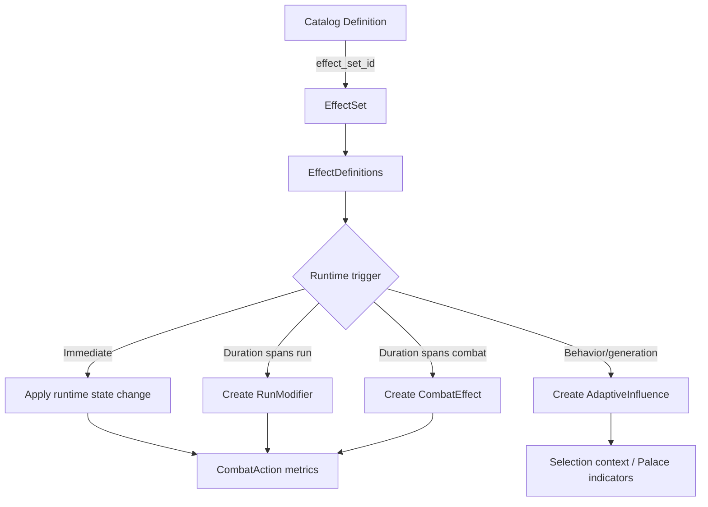

# 03 — Effect, modifier, and duration model

Version: `data-model-0.1-rc2`

## Overview

Effects are the mechanism by which skills, items, laws, curses, rewards, room mechanics, and future adaptive systems modify gameplay state. Effects must be composable, inspectable, deterministic, and usable without duplicating sources of truth.

## Effect source of truth

EffectSet is the canonical source of effects in Catalog.
Skill, Item, Law, Curse and other gameplay definitions reference an EffectSet through `effect_set_id`.
Per-entity effect tables are not part of data-model-0.1 to avoid duplicate sources of truth.

Deprecated / not retained for data-model-0.1:

- `catalog_skill_effects`
- `catalog_item_effects`
- `catalog_palace_law_effects`
- `catalog_curse_effects`

## Conceptual entities

### EffectSet

Catalog-owned, versioned effect container. Referenced by definitions such as skills, items, laws, curses, reward options, or room special mechanics.

### EffectDefinition

Catalog-owned child row of an EffectSet. Defines one effect entry: type, target scope, value, duration, stack policy, ordering, and optional behavior/generation tags.

### RunModifier

Game Engine runtime modifier created from an EffectDefinition when the effect duration spans more than an immediate action.

### CombatEffect / CombatModifier

Game Engine combat-scoped runtime effect. Future table/state for temporary combat effects.

### AdaptiveInfluence

Game Engine runtime projection created by behavior/generation effects for Markov/adaptive selection. It does not expose internal matrices.

## EffectType

Numeric/stat effects:

```text
HealVitality
DamageVitality
AddCurrentGuard
AddStartingGuard
ModifyAttackPower
ModifyDefense
ModifySpeed
ModifyInitiative
ModifyRecovery
ModifyDifficultyMultiplier
ModifyRewardPowerMultiplier
RestoreFocus
RestoreMana
RestoreCharge
ApplyWeaken
ApplyDisrupt
GrantRunItem
GrantRunModifier
GrantPermanentUnlockCandidate
```

Behavioral and generation effects:

```text
ModifyEnemyBehavior
ModifyTargetingBias
ModifyGenerationWeight
ModifyRoomSelectionBias
ModifyEnemySelectionBias
ModifyRewardSelectionBias
ModifyLawSelectionBias
ModifyCurseSelectionBias
ApplyBehaviorTag
ApplyNarrativePressure
```

## EffectTargetScope

```text
Self
SingleEnemy
AllEnemies
SingleAlly
AllAllies
Run
Room
NextCombat
NextReward
SelectionContext
Palace
```

## EffectDuration

```text
Immediate
CurrentCombat
NextCombatOnly
NextRewardOnly
UntilRoomEnds
UntilRunEnds
PermanentCandidate
UntilConsumed
```

## StackPolicy

```text
None
Additive
HighestOnly
RefreshDuration
Replace
UniqueBySource
```

## ValueMode

```text
Flat
Percent
Multiplier
WeightDelta
Bias
TagOnly
```

## Structured effect fields

`catalog_effect_definitions` should include explicit fields for data used by backend selection or behavior systems:

```text
behavior_tag VARCHAR(128) NULL
selection_group VARCHAR(64) NULL
```

These fields may not be hidden inside JSON if they influence Markov/adaptive selection or combat AI. Non-structural flavor metadata may use metadata JSON later if needed.

## Guard passive rule

`AddStartingGuard` effects use this computation at combat creation:

```text
effective_starting_guard = character_base_starting_guard + SUM(active AddStartingGuard modifiers)
```

Rules:

- Use immutable run character snapshots as the base.
- Never use a previous combat runtime value as the base.
- Apply active modifiers once and sum idempotently.
- Write the result to `run_combatant_base_stat_snapshots.starting_guard`.
- Initialize `run_combatant_runtime_states.current_guard` from that value.
- Do not store `current_guard` in a snapshot table.

## Effect application flow



## Behavioral example

```text
Law:
La Mefiance des Echos

Effect:
ModifyEnemyBehavior

TargetScope:
AllEnemies

BehaviorTag:
behavior.paranoid

Value:
0.15

Duration:
UntilRoomEnds

Gameplay meaning:
Enemies may be biased toward unstable targeting, including possible ally targeting in future combat AI.

Markov meaning:
Adds an adaptive influence readable by the selection/context system without exposing matrix internals.
```

## Naming corrections

Use `item.consumable.eclat-de-garde` for the guard shard example. `item.consumable.ecart-de-garde` is a typo and must not be used as the target key.
