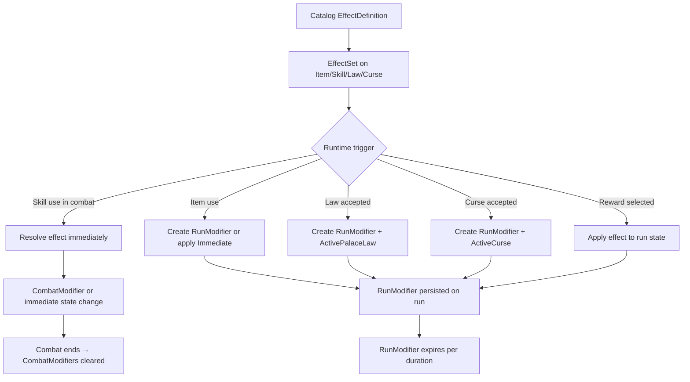

# 03 — Effect, modifier, and duration model

## Overview

This document defines the unified effect system for L'épopée des silences. Effects are the mechanism by which items, skills, laws, curses, and rewards modify game state. The model is designed to be composable, predictable, and ATB-ready.

## Conceptual entities

### EffectDefinition (Catalog)

A reusable, named effect template stored in Catalog. Defines WHAT happens, not WHEN or TO WHOM.

Example: `effect.heal-vitality` — restores vitality to a target.

### EffectSet (Catalog)

A ordered collection of `EffectDefinition` references attached to a Catalog entity (item, skill, law, curse). Defines the set of effects that fire together.

Example: `item.consumable.baume-de-memoire` → EffectSet containing `[effect.heal-vitality-25]`.

### RuntimeEffect (Game Engine)

A resolved, instantiated effect during combat or run. Created from an `EffectDefinition` + target resolution. Mutable, tracks application state.

### RunModifier (Game Engine)

A persistent modifier attached to a run. Created by items, laws, curses, or rewards. Applies its effect at the appropriate lifecycle point (combat start, round start, reward calculation).

### CombatModifier (Game Engine, future)

A transient modifier active only during a single combat encounter. Created by combat skills or effects. Expires at combat end.

## Enums

### EffectType

Defines WHAT the effect does.

```text
HealVitality               → Restores current_vitality to a target
DamageVitality             → Reduces current_vitality of a target
AddCurrentGuard            → Adds to current_guard (combat only)
AddStartingGuard           → Adds to starting_guard (persistent via RunModifier)
ModifyAttackPower          → Modifies attack_power (persistent via RunModifier)
ModifyDefense              → Modifies defense (persistent via RunModifier)
ModifySpeed                → Modifies speed (persistent via RunModifier)
ModifyInitiative           → Modifies initiative (persistent via RunModifier)
ModifyRecovery             → Modifies recovery (persistent via RunModifier)
ModifyDifficultyMultiplier → Modifies difficulty_multiplier (persistent via RunModifier)
ModifyRewardPowerMultiplier → Modifies reward_power_multiplier (persistent via RunModifier)
RestoreFocus               → Restores focus
ApplyWeaken                → Reduces target's attack_power temporarily
ApplyDisrupt               → Reduces target's defense temporarily
GrantRunItem               → Adds a RunItem to inventory
GrantRunModifier           → Creates a RunModifier on the run
GrantPermanentUnlockCandidate → Projects an unlock candidate to Player via outbox
```

### EffectTargetScope

Defines TO WHOM the effect applies.

```text
Self           → The actor (the one using the skill/item)
SingleEnemy    → One enemy selected by targeting rules
AllEnemies     → All enemies
SingleAlly     → One ally selected by targeting rules
AllAllies      → All allies
Run            → The run itself (global modifier)
Room           → The current room
NextCombat     → The next combat encounter only
NextReward     → The next reward offer only
```

### EffectDuration

Defines HOW LONG the effect lasts.

```text
Immediate            → Applied once, no persistence (heal, damage)
CurrentCombat        → Lasts until combat ends
NextCombatOnly       → Persists to next combat, then consumed
NextRewardOnly       → Persists to next reward offer, then consumed
UntilRoomEnds        → Persists until current room is completed
UntilRunEnds         → Persists until run ends (completed/failed/abandoned)
PermanentCandidate   → Projects to Player via outbox if run completes successfully
```

### StackPolicy

Defines HOW MULTIPLE instances of the same effect interact.

```text
None             → No stacking; new instance is rejected if one exists
Additive         → Values are summed (e.g., +8 guard + +5 guard = +13)
HighestOnly      → Only the highest value is active
RefreshDuration  → New instance refreshes the timer but keeps the value
Replace          → New instance replaces the old one entirely
```

### ValueMode

Defines HOW the value is interpreted.

```text
Flat         → Absolute integer value (+8, -5)
Percent      → Percentage of base value (+10% = base * 1.10)
Multiplier   → Direct multiplier (1.10 = +10%)
```

## Current RunModifier model (existing code)

The current `RunModifier` entity has:

```text
RunModifierType:
  StartingGuardBonus = 0
  NextCombatDifficultyMultiplier = 1
  RewardPowerMultiplierBonus = 2
  PermanentCombatDifficultyBonus = 3

RunModifierDuration:
  UntilRunEnds = 0
  NextCombatOnly = 1
  UntilRoomEnds = 2
```

**Gap analysis:** The current model lacks:
- `EffectType` (what the modifier does beyond the 4 types)
- `StackPolicy` (how multiple modifiers combine)
- `ValueMode` (flat vs percent vs multiplier)
- `CombatModifier` (combat-only transient modifiers)
- `EffectTargetScope` (who is affected)
- ATB-related modifier types

## Guard passive rule

### Design rule

`AddStartingGuard` effects must follow this exact computation:

```text
effective_starting_guard = character_base_starting_guard + SUM(active AddStartingGuard modifiers)
```

**Constraints:**
- All active `AddStartingGuard` modifiers with `StackPolicy = Additive` are summed.
- The result is capped by `MaxStartingGuardBonus` (currently 30).
- This computation is performed ONCE at combat creation.
- The modifiers are NOT consumed (they persist until their duration expires).
- At each new round, `current_guard` is reset to `base_guard` (the floor, not the computed starting value).
- `starting_guard` is NOT re-computed on room change; it is re-computed only at combat creation.

### The guard doubling bug (known issue)

**Observed behavior:** Bonus de garde doublait lors du changement de room.

**Probable cause:**
1. Player enters room → `RunModifier(StartingGuardBonus, +8)` is active.
2. Combat starts → `starting_guard = 0 + 8 = 8`. Combatant created with `base_guard = 8`.
3. Room completed → player moves to next room.
4. New combat starts → the system reads `starting_guard` from the previous combatant's `base_guard` (8) AND re-applies the `RunModifier(+8)` → `starting_guard = 8 + 8 = 16`.

**Root cause:** The base value was read from the previous combat's runtime state instead of from the character snapshot.

**Fix rule:**
- `starting_guard` is ALWAYS computed from `character_snapshot.starting_guard + SUM(active modifiers)`.
- NEVER from a previous combat's `base_guard`.
- The character snapshot is immutable during the run.

## Effect application flow



## Narrative examples from the Palais

### Éclat de garde (Guard Shard)

```text
Source: RewardOption after combat
Flow:
  1. Player selects "Éclat de garde" reward
  2. RunItem created: definition_key="item.consumable.ecart-de-garde", EffectType=AddStartingGuard, EffectAmount=8
  3. RunItem used → RunModifier created:
     - Type: AddStartingGuard
     - Value: 8
     - ValueMode: Flat
     - StackPolicy: Additive
     - Duration: UntilRunEnds
     - SourceType: RunItem
     - SourceKey: "item.consumable.ecart-de-garde"
  4. Next combat: effective_starting_guard = 0 + 8 = 8
  5. Second Éclat: new RunModifier(+8, Additive) → effective_starting_guard = 0 + 8 + 8 = 16
  6. Capped at MaxStartingGuardBonus = 30
```

### Souffle Lourd (Heavy Breath — Curse)

```text
Source: CurseDefinition on a Curse node event
Flow:
  1. Player encounters curse node → ResolveCurrentEvent
  2. CurseDefinition: key="curse.threshold.souffle-lourd", severity=1, effects=[ModifyDifficultyMultiplier +0.10]
  3. ActiveCurse created on run: key, display_name, description, difficulty_delta=+0.10
  4. RunModifier created:
     - Type: NextCombatDifficultyMultiplier
     - Value: 0.10
     - ValueMode: Flat (added to base 1.0)
     - StackPolicy: Additive
     - Duration: NextCombatOnly
     - SourceType: Curse
     - SourceKey: "curse.threshold.souffle-lourd"
  5. Next combat: difficulty_multiplier = 1.0 + 0.10 = 1.10
  6. Enemy stats scaled by 1.10
  7. After combat: modifier consumed, ActiveCurse cleared
```

### Le Poids du Silence (The Weight of Silence — Law)

```text
Source: PalaceLawDefinition on a Law node event
Flow:
  1. Player encounters law node → sees law description + preview
  2. Player accepts → ActivePalaceLaw created on run
  3. PalaceLawDefinition: key="law.threshold.silence-weight", effects=[
       AddStartingGuard +5 UntilRunEnds,
       ModifyDifficultyMultiplier +0.05 UntilRunEnds
     ]
  4. Two RunModifiers created:
     a. Type: StartingGuardBonus, Value: 5, Duration: UntilRunEnds
     b. Type: PermanentCombatDifficultyBonus, Value: 0.05, Duration: UntilRunEnds
  5. All subsequent combats: starting_guard += 5, difficulty *= 1.05
  6. Persists until run ends
```

### Don Terni (Tarnished Gift — Item from Merchant)

```text
Source: Merchant event, player purchases item
Flow:
  1. Player meets merchant → offered items
  2. Player selects "Don Terni" (item.consumable.don-terni)
  3. RunItem created: EffectType=HealVitality, EffectAmount=25
  4. Player uses item outside combat:
     - current_vitality += 25 (capped at max_vitality)
     - Quantity decremented by 1
  5. No RunModifier created (Immediate effect)
```

### Les Pas Répétés (The Repeated Steps — Narrative Fragment)

```text
Source: Memory event
Flow:
  1. Player encounters memory node → narrative fragment revealed
  2. No mechanical effect
  3. Memory fragment key added to Run.MemoryFragments
  4. Displayed in Tome/Journal
```
