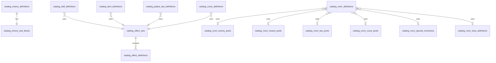

# 04 — Catalog relational schema

Version: `data-model-0.1-rc2`

## Overview

Catalog owns stable, versioned gameplay definitions. Catalog does not own runtime state and does not store player progression. Catalog tables use explicit relational columns for primary gameplay data and stable dot-notation keys for cross-service references.

## Effect source of truth

EffectSet is the canonical source of effects in Catalog.
Skill, Item, Law, Curse and other gameplay definitions reference an EffectSet through `effect_set_id`.
Per-entity effect tables are not part of data-model-0.1 to avoid duplicate sources of truth.

Retained:

- `catalog_effect_sets`
- `catalog_effect_definitions`

Deprecated / not retained:

- `catalog_skill_effects`
- `catalog_item_effects`
- `catalog_palace_law_effects`
- `catalog_curse_effects`

## One-to-one stat block rule

For 1:1 stat blocks, parent tables do not carry `stat_block_id`. The child stat block carries the parent id with a UNIQUE constraint.

```text
catalog_enemy_definitions
- id PK
- key
- ...

catalog_enemy_stat_blocks
- id PK
- enemy_definition_id UUID UNIQUE NOT NULL FK
- max_vitality
- attack_power
- ...
```

## Core Catalog tables

### catalog_versions

| Column | Type | Notes |
|--------|------|-------|
| `id` | UUID PK | seed application id |
| `seed_key` | VARCHAR(128) UNIQUE with version | logical seed identifier |
| `version` | VARCHAR(64) | seed version |
| `checksum` | VARCHAR(256) NULL | optional integrity check |
| `applied_at_utc` | TIMESTAMPTZ NOT NULL | application timestamp |

### catalog_tags

| Column | Type | Notes |
|--------|------|-------|
| `id` | UUID PK | tag id |
| `tag_key` | VARCHAR(128) UNIQUE NOT NULL | stable tag key |
| `display_name` | VARCHAR(256) NOT NULL | display label |
| `category` | VARCHAR(64) NULL | archetype, room, behavior, generation, etc. |
| `created_at_utc` | TIMESTAMPTZ NOT NULL | creation timestamp |

Tags that participate in filtering or Markov/adaptive selection must be relational. Do not hide important selection tags in JSON.

## Enemy definitions

### catalog_enemy_definitions

| Column | Type | Notes |
|--------|------|-------|
| `id` | UUID PK | definition id |
| `key` | VARCHAR(160) UNIQUE NOT NULL | e.g. `enemy.threshold.doubt-fragment` |
| `display_name` | VARCHAR(256) NOT NULL | display name |
| `description` | TEXT NOT NULL | description |
| `narrative_text` | TEXT NULL | optional narrative |
| `archetype` | VARCHAR(64) NOT NULL | EnemyArchetype |
| `family` | VARCHAR(64) NULL | EnemyFamily |
| `rank` | VARCHAR(64) NOT NULL | Common, Elite, Boss |
| `role` | VARCHAR(64) NULL | Tank, DPS, Support, Disruptor |
| `base_difficulty` | INT NOT NULL | 1-20 |
| `encounter_weight` | INT NOT NULL DEFAULT 1 | selection weight |
| `min_depth` | INT NULL | minimum run depth |
| `max_depth` | INT NULL | maximum run depth |
| `selection_group` | VARCHAR(64) NULL | adaptive selection group |
| `is_boss` | BOOLEAN NOT NULL DEFAULT FALSE | boss marker |
| `is_elite` | BOOLEAN NOT NULL DEFAULT FALSE | elite marker |
| `reward_profile_key` | VARCHAR(128) NULL | reward profile reference |
| `version` | VARCHAR(32) NOT NULL | definition version |
| `status` | VARCHAR(32) NOT NULL | Draft, Active, Deprecated, Disabled |
| `created_at_utc` | TIMESTAMPTZ NOT NULL | creation timestamp |
| `updated_at_utc` | TIMESTAMPTZ NOT NULL | update timestamp |

No `stat_block_id` column exists on this table.

### catalog_enemy_stat_blocks

| Column | Type | Notes |
|--------|------|-------|
| `id` | UUID PK | stat block id |
| `enemy_definition_id` | UUID UNIQUE NOT NULL FK | parent enemy |
| `max_vitality` | INT NOT NULL | base max HP |
| `attack_power` | INT NOT NULL | base attack |
| `defense` | INT NOT NULL | base defense |
| `starting_guard` | INT NOT NULL DEFAULT 0 | base guard |
| `speed` | INT NOT NULL | base speed |
| `initiative` | INT NOT NULL DEFAULT 0 | ATB-ready |
| `recovery` | INT NOT NULL DEFAULT 0 | ATB-ready |
| `focus` | INT NOT NULL DEFAULT 0 | base focus |
| `mana` | INT NOT NULL DEFAULT 0 | base mana |
| `charge` | INT NOT NULL DEFAULT 0 | base charge |

### catalog_enemy_skill_links

| Column | Type | Notes |
|--------|------|-------|
| `enemy_definition_id` | UUID NOT NULL FK | enemy definition |
| `skill_definition_key` | VARCHAR(160) NOT NULL | Catalog skill key |

Primary key: `(enemy_definition_id, skill_definition_key)`.

### catalog_enemy_tags

Junction table: `enemy_definition_id`, `tag_id`.

## Skill definitions

### catalog_skill_definitions

| Column | Type | Notes |
|--------|------|-------|
| `id` | UUID PK | definition id |
| `key` | VARCHAR(160) UNIQUE NOT NULL | e.g. `skill.basic.strike` |
| `display_name` | VARCHAR(256) NOT NULL | display name |
| `description` | TEXT NOT NULL | description |
| `narrative_text` | TEXT NULL | narrative text |
| `skill_type` | VARCHAR(64) NOT NULL | Damage, Guard, Weaken, etc. |
| `targeting_mode` | VARCHAR(64) NOT NULL | Self, SingleEnemy, AllEnemies, etc. |
| `cost_type` | VARCHAR(32) NOT NULL | Mana, Charge, Focus, None |
| `cost_amount` | INT NOT NULL DEFAULT 0 | cost amount |
| `power` | INT NOT NULL DEFAULT 0 | primary power |
| `accuracy` | INT NOT NULL DEFAULT 100 | hit chance |
| `action_cost` | INT NOT NULL DEFAULT 10 | ATB-ready |
| `cast_time` | INT NOT NULL DEFAULT 0 | ATB-ready |
| `recovery_time` | INT NOT NULL DEFAULT 0 | ATB-ready |
| `cooldown` | INT NOT NULL DEFAULT 0 | future use |
| `base_weight` | INT NOT NULL DEFAULT 1 | adaptive metadata |
| `selection_group` | VARCHAR(64) NULL | adaptive metadata |
| `effect_set_id` | UUID NULL FK | canonical effects |
| `version` | VARCHAR(32) NOT NULL | definition version |
| `status` | VARCHAR(32) NOT NULL | lifecycle status |
| `created_at_utc` | TIMESTAMPTZ NOT NULL | creation timestamp |
| `updated_at_utc` | TIMESTAMPTZ NOT NULL | update timestamp |

## Item definitions

### catalog_item_definitions

| Column | Type | Notes |
|--------|------|-------|
| `id` | UUID PK | definition id |
| `key` | VARCHAR(160) UNIQUE NOT NULL | e.g. `item.consumable.eclat-de-garde` |
| `display_name` | VARCHAR(256) NOT NULL | display name |
| `description` | TEXT NOT NULL | description |
| `narrative_text` | TEXT NULL | narrative text |
| `item_type` | VARCHAR(64) NOT NULL | Heal, Guard, ResourceRestore, etc. |
| `category` | VARCHAR(64) NOT NULL | Consumable, Relic, Fragment, etc. |
| `rarity` | VARCHAR(64) NOT NULL | Common, Uncommon, Rare, Epic, Unique |
| `usage_mode` | VARCHAR(64) NOT NULL | Passive, UseInCombat, UseOnNode, NotUsable |
| `lifecycle` | VARCHAR(64) NOT NULL | RuntimeRunOnly, PermanentUnlockCandidate, etc. |
| `stack_policy` | VARCHAR(32) NOT NULL DEFAULT 'Additive' | quantity stacking |
| `max_stack` | INT NOT NULL DEFAULT 1 | max quantity |
| `is_usable_in_combat` | BOOLEAN NOT NULL DEFAULT FALSE | battle use |
| `is_usable_outside_combat` | BOOLEAN NOT NULL DEFAULT FALSE | run use |
| `effect_set_id` | UUID NULL FK | canonical effects |
| `min_depth` | INT NULL | selection metadata |
| `max_depth` | INT NULL | selection metadata |
| `base_weight` | INT NOT NULL DEFAULT 1 | selection weight |
| `selection_group` | VARCHAR(64) NULL | selection group |
| `version` | VARCHAR(32) NOT NULL | definition version |
| `status` | VARCHAR(32) NOT NULL | lifecycle status |
| `created_at_utc` | TIMESTAMPTZ NOT NULL | creation timestamp |
| `updated_at_utc` | TIMESTAMPTZ NOT NULL | update timestamp |

### catalog_item_tags

Junction table: `item_definition_id`, `tag_id`.

## Law and curse definitions

### catalog_palace_law_definitions

| Column | Type | Notes |
|--------|------|-------|
| `id` | UUID PK | definition id |
| `key` | VARCHAR(160) UNIQUE NOT NULL | law key |
| `display_name` | VARCHAR(256) NOT NULL | display name |
| `description` | TEXT NOT NULL | description |
| `narrative_text` | TEXT NULL | narrative |
| `scope` | VARCHAR(64) NOT NULL | Room, Run, Permanent |
| `duration` | VARCHAR(64) NOT NULL | default duration |
| `trigger` | VARCHAR(64) NULL | activation trigger |
| `severity` | INT NOT NULL DEFAULT 1 | severity |
| `visibility` | VARCHAR(32) NOT NULL | Visible, PartiallyVisible, Hidden |
| `priority` | INT NOT NULL DEFAULT 0 | ordering |
| `base_weight` | INT NOT NULL DEFAULT 1 | selection weight |
| `min_depth` | INT NULL | selection metadata |
| `max_depth` | INT NULL | selection metadata |
| `selection_group` | VARCHAR(64) NULL | adaptive group |
| `effect_set_id` | UUID NULL FK | canonical effects |
| `version` | VARCHAR(32) NOT NULL | definition version |
| `status` | VARCHAR(32) NOT NULL | lifecycle status |
| `created_at_utc` | TIMESTAMPTZ NOT NULL | creation timestamp |
| `updated_at_utc` | TIMESTAMPTZ NOT NULL | update timestamp |

### catalog_curse_definitions

Same ownership and structure as laws, with `curse_definition` semantics and severity/duration/trigger/effect_set_id.

### catalog_law_tags / catalog_curse_tags

Junction tables for relational Markov/adaptive filtering.

## Reward templates

### catalog_reward_templates

| Column | Type | Notes |
|--------|------|-------|
| `id` | UUID PK | template id |
| `key` | VARCHAR(160) UNIQUE NOT NULL | reward template key |
| `display_name` | VARCHAR(256) NOT NULL | display name |
| `description` | TEXT NOT NULL | description |
| `source_type` | VARCHAR(64) NOT NULL | Combat, Elite, RoomBoss, Merchant, Law, etc. |
| `min_options` | INT NOT NULL DEFAULT 1 | minimum options |
| `max_options` | INT NOT NULL DEFAULT 3 | maximum options |
| `min_depth` | INT NULL | selection metadata |
| `max_depth` | INT NULL | selection metadata |
| `base_weight` | INT NOT NULL DEFAULT 1 | selection weight |
| `selection_group` | VARCHAR(64) NULL | selection group |
| `version` | VARCHAR(32) NOT NULL | template version |
| `status` | VARCHAR(32) NOT NULL | lifecycle status |
| `created_at_utc` | TIMESTAMPTZ NOT NULL | creation timestamp |
| `updated_at_utc` | TIMESTAMPTZ NOT NULL | update timestamp |

### catalog_reward_template_options

| Column | Type | Notes |
|--------|------|-------|
| `id` | UUID PK | option id |
| `reward_template_id` | UUID NOT NULL FK | parent template |
| `reward_type` | VARCHAR(64) NOT NULL | Heal, TemporaryItem, StatBonus, MemoryFragment, etc. |
| `label` | VARCHAR(256) NOT NULL | option label |
| `description` | TEXT NOT NULL | description |
| `payload_key` | VARCHAR(256) NULL | item/stat/fragment key |
| `base_amount` | INT NULL | amount before scaling |
| `scaling_mode` | VARCHAR(32) NOT NULL DEFAULT 'Flat' | Flat, Percent, Multiplier |
| `weight` | INT NOT NULL DEFAULT 1 | weight within template |
| `effect_set_id` | UUID NULL FK | optional canonical effect set |

Use `RewardOption` as the target concept name. `RewardChoice` is legacy wording.

## Effect tables

### catalog_effect_sets

| Column | Type | Notes |
|--------|------|-------|
| `id` | UUID PK | effect set id |
| `key` | VARCHAR(160) UNIQUE NOT NULL | stable effect set key |
| `display_name` | VARCHAR(256) NOT NULL | display name |
| `description` | TEXT NULL | description |
| `version` | VARCHAR(32) NOT NULL | version |
| `status` | VARCHAR(32) NOT NULL | lifecycle status |
| `created_at_utc` | TIMESTAMPTZ NOT NULL | creation timestamp |
| `updated_at_utc` | TIMESTAMPTZ NOT NULL | update timestamp |

### catalog_effect_definitions

| Column | Type | Notes |
|--------|------|-------|
| `id` | UUID PK | effect id |
| `effect_set_id` | UUID NOT NULL FK | parent EffectSet |
| `effect_type` | VARCHAR(64) NOT NULL | EffectType |
| `target_scope` | VARCHAR(64) NOT NULL | EffectTargetScope |
| `value` | DECIMAL(10,4) NULL | numeric value if applicable |
| `value_mode` | VARCHAR(32) NOT NULL DEFAULT 'Flat' | ValueMode |
| `duration` | VARCHAR(64) NOT NULL DEFAULT 'Immediate' | EffectDuration |
| `stack_policy` | VARCHAR(32) NOT NULL DEFAULT 'None' | StackPolicy |
| `condition` | VARCHAR(256) NULL | optional condition |
| `order` | INT NOT NULL DEFAULT 0 | execution order |
| `behavior_tag` | VARCHAR(128) NULL | behavior effect tag |
| `generation_tag` | VARCHAR(128) NULL | generation/adaptive tag |
| `selection_group` | VARCHAR(64) NULL | selection group |

## Catalog room model

Catalog room definitions prepare future room generation, rare rooms, cultural echo rooms, anomaly rooms, boss rooms, room mechanics, enemy pools, reward pools, law pools, curse pools, and Markov/adaptive metadata. This model prepares future implementation; it does not implement rare rooms.

Conceptual entities:

```text
RoomDefinition
RoomTypeDefinition
RoomEnemyPool
RoomRewardPool
RoomLawPool
RoomCursePool
RoomSpecialMechanic
RoomTag
RoomBossDefinition
```

Tables:

```text
catalog_room_definitions
catalog_room_type_definitions
catalog_room_enemy_pools
catalog_room_enemy_pool_entries
catalog_room_reward_pools
catalog_room_reward_pool_entries
catalog_room_law_pools
catalog_room_law_pool_entries
catalog_room_curse_pools
catalog_room_curse_pool_entries
catalog_room_special_mechanics
catalog_room_tags
catalog_room_boss_definitions
```

### catalog_room_definitions

```text
id UUID PK
key VARCHAR(160) UNIQUE NOT NULL
display_name VARCHAR(256) NOT NULL
description TEXT NOT NULL
narrative_text TEXT NULL
room_family VARCHAR(64) NOT NULL
room_rarity VARCHAR(64) NOT NULL
theme VARCHAR(128) NOT NULL
min_depth INT NULL
max_depth INT NULL
base_weight INT NOT NULL DEFAULT 1
selection_group VARCHAR(64) NULL
enemy_pool_key VARCHAR(160) NULL
reward_pool_key VARCHAR(160) NULL
law_pool_key VARCHAR(160) NULL
curse_pool_key VARCHAR(160) NULL
special_mechanic_key VARCHAR(160) NULL
boss_definition_key VARCHAR(160) NULL
is_unique BOOLEAN NOT NULL DEFAULT FALSE
is_cultural_echo BOOLEAN NOT NULL DEFAULT FALSE
version VARCHAR(32) NOT NULL
status VARCHAR(32) NOT NULL
created_at_utc TIMESTAMPTZ NOT NULL
updated_at_utc TIMESTAMPTZ NOT NULL
```

### catalog_room_type_definitions

Defines stable room type metadata: `key`, `display_name`, `description`, `room_family`, `default_rarity`, `default_theme`, `version`, `status`.

### catalog_room_enemy_pools / entries

Pool header: `key`, `display_name`, `description`, `min_depth`, `max_depth`, `selection_group`, `version`, `status`.

Entries: `pool_id`, `enemy_definition_key`, `weight`, `min_count`, `max_count`, `required_tag`, `excluded_tag`.

### catalog_room_reward_pools / entries

Pool header: same pattern. Entries reference `reward_template_key` or `item_definition_key`, with `weight`, depth constraints, and optional tags.

### catalog_room_law_pools / entries

Pool header: same pattern. Entries reference `law_definition_key`, with `weight`, depth constraints, and optional tags.

### catalog_room_curse_pools / entries

Pool header: same pattern. Entries reference `curse_definition_key`, with `weight`, depth constraints, and optional tags.

### catalog_room_special_mechanics

Defines special mechanics such as `equivalent_exchange`. Columns include `key`, `display_name`, `description`, `mechanic_type`, `effect_set_id NULL`, `selection_group NULL`, `version`, `status`.

### catalog_room_tags

Junction table linking `room_definition_id` to `catalog_tags.id`.

### catalog_room_boss_definitions

Defines boss metadata for rooms: `key`, `display_name`, `description`, `enemy_definition_key`, `room_definition_key`, `danger_hint`, `base_weight`, `version`, `status`.

## Rare rooms and cultural echo rooms

Rules:

- Rare rooms may evoke cultural, mythological, literary, or symbolic archetypes.
- They must not reuse protected names, characters, organizations, symbols, or terminology from existing works.
- The model stores abstract inspiration or theme, never a copy of a work.
- Allowed example: `room.rare.creuset-equivalences`.
- Forbidden example: `room.rare.fma`.

Example:

```text
Room key:
room.rare.creuset-equivalences

Display name:
Le Creuset des Equivalences

RoomFamily:
CulturalEcho

RoomRarity:
Rare

Theme:
Alchemical

Special mechanic:
equivalent_exchange

Design intent:
Une salle ou chaque puissance offerte exige une dette.

Allowed inspiration:
alchemy, equivalent exchange, body debt, artificial life, guilt.

Forbidden:
direct references to protected works, character names, organization names, recognizable symbols.
```

## Enums

```text
RoomFamily
- PalaceCore
- Memory
- Law
- Curse
- Merchant
- Rest
- Boss
- CulturalEcho
- Anomaly
- Interlude
- Final

RoomRarity
- Common
- Uncommon
- Rare
- Mythic
- Unique

RoomTheme
- Threshold
- Forest
- Rupture
- Silence
- Antechamber
- Memory
- Final
- Alchemical
- Mirror
- Library
- Theatre
- Garden
- Forge
```

Additional Catalog enums include ItemCategory, ItemType, UsageMode, Lifecycle, EnemyArchetype, EnemyFamily, EnemyRank, EnemyRole, SkillType, TargetingMode, EffectType, EffectTargetScope, EffectDuration, StackPolicy, ValueMode, PalaceLawVisibility, PalaceLawScope, RewardType, RewardSource.

EffectType must include behavioral/generation values from `03-effect-modifier-and-duration-model.md`.

## ERD excerpt


