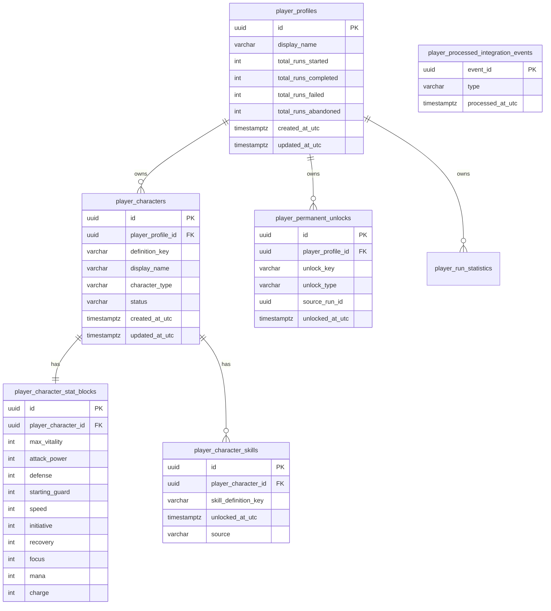

# 05 — Player relational schema

## Overview

The Player service owns permanent player progression. This document defines the target relational schema for all Player tables.

## player_profiles

Core player identity and progression statistics.

| Column | Type | Nullable | Default | Description |
|--------|------|----------|---------|-------------|
| `id` | UUID | NOT NULL | gen_random_uuid() | Primary key |
| `display_name` | VARCHAR(128) | NOT NULL | — | Player display name |
| `total_runs_started` | INT | NOT NULL | 0 | Lifetime runs started |
| `total_runs_completed` | INT | NOT NULL | 0 | Lifetime runs completed |
| `total_runs_failed` | INT | NOT NULL | 0 | Lifetime runs failed |
| `total_runs_abandoned` | INT | NOT NULL | 0 | Lifetime runs abandoned |
| `created_at_utc` | TIMESTAMPTZ | NOT NULL | now() | Profile creation timestamp |
| `updated_at_utc` | TIMESTAMPTZ | NOT NULL | now() | Last update timestamp |

**Primary key:** `id`
**Unique constraints:** none (id is sufficient)
**Indexes:** `created_at_utc`
**Relations:** 1:N → `player_characters`

**Current state:** Implemented. Progression stats are embedded directly in `player_profiles` rather than in a separate `player_progression` table. This is acceptable for the current scope.

---

## player_characters

Characters owned by a player. Each character has permanent base stats.

| Column | Type | Nullable | Default | Description |
|--------|------|----------|---------|-------------|
| `id` | UUID | NOT NULL | gen_random_uuid() | Primary key |
| `player_profile_id` | UUID | NOT NULL | — | FK → `player_profiles.id` (CASCADE) |
| `definition_key` | VARCHAR(160) | NOT NULL | — | Character definition key (e.g., `character.player.self`) |
| `display_name` | VARCHAR(256) | NOT NULL | — | Character display name |
| `character_type` | VARCHAR(64) | NOT NULL | 'standard' | Character type classification |
| `status` | VARCHAR(32) | NOT NULL | 'active' | Character status |
| `created_at_utc` | TIMESTAMPTZ | NOT NULL | now() | Creation timestamp |
| `updated_at_utc` | TIMESTAMPTZ | NOT NULL | now() | Last update timestamp |

**Primary key:** `id`
**Unique constraints:** `(player_profile_id, definition_key)` — one character per definition per player
**Indexes:** `player_profile_id`, `definition_key`
**Relations:** FK → `player_profiles.id` (N:1, CASCADE); 1:1 → `player_character_stat_blocks`; 1:N → `player_character_skills`

**Current state:** Partially implemented. Missing `character_type`, `status`, `updated_at_utc`. `SkillKeys` stored as JSON column (`skill_keys_json`) rather than relational table.

---

## player_character_stat_blocks

Permanent base stats for player characters. Separated from `player_characters` to follow the same pattern as `catalog_enemy_stat_blocks`.

| Column | Type | Nullable | Default | Description |
|--------|------|----------|---------|-------------|
| `id` | UUID | NOT NULL | gen_random_uuid() | Primary key |
| `player_character_id` | UUID | NOT NULL | — | FK → `player_characters.id` (UNIQUE, CASCADE) |
| `max_vitality` | INT | NOT NULL | 100 | Permanent max vitality |
| `attack_power` | INT | NOT NULL | 12 | Permanent attack power |
| `defense` | INT | NOT NULL | 6 | Permanent defense |
| `starting_guard` | INT | NOT NULL | 0 | Permanent starting guard |
| `speed` | INT | NOT NULL | 10 | Permanent speed |
| `initiative` | INT | NOT NULL | 10 | Permanent initiative (ATB-ready) |
| `recovery` | INT | NOT NULL | 5 | Permanent recovery (ATB-ready) |
| `focus` | INT | NOT NULL | 0 | Permanent focus |
| `mana` | INT | NOT NULL | 0 | Permanent base mana |
| `charge` | INT | NOT NULL | 0 | Permanent base charge |

**Primary key:** `id`
**Unique constraints:** `player_character_id`
**Indexes:** none additional
**Relations:** FK → `player_characters.id` (1:1, CASCADE)

**Current state:** Not yet exists. Stats are currently embedded in `player_characters` as `MaxVitality`, `BaseMana`, `BaseCharge`. Missing `attack_power`, `defense`, `starting_guard`, `speed`, `initiative`, `recovery`, `focus`.

**Default values for "Le Porteur" (character.player.self):**
- `max_vitality` = 100
- `attack_power` = 12
- `defense` = 6
- `starting_guard` = 0
- `speed` = 10
- `initiative` = 10
- `recovery` = 5
- `focus` = 0
- `mana` = 0
- `charge` = 0

---

## player_character_skills

Skills unlocked on a player character. Replaces the current `skill_keys_json` JSON column.

| Column | Type | Nullable | Default | Description |
|--------|------|----------|---------|-------------|
| `id` | UUID | NOT NULL | gen_random_uuid() | Primary key |
| `player_character_id` | UUID | NOT NULL | — | FK → `player_characters.id` (CASCADE) |
| `skill_definition_key` | VARCHAR(160) | NOT NULL | — | Reference to `catalog_skill_definitions.key` |
| `unlocked_at_utc` | TIMESTAMPTZ | NOT NULL | now() | When skill was unlocked |
| `source` | VARCHAR(64) | NULL | NULL | How skill was unlocked (default, run_reward, permanent_unlock) |

**Primary key:** `id`
**Unique constraints:** `(player_character_id, skill_definition_key)`
**Indexes:** `player_character_id`, `skill_definition_key`
**Relations:** FK → `player_characters.id` (N:1, CASCADE)

**Current state:** Not yet exists. Skills stored as JSON array in `skill_keys_json`.

---

## player_progression

Run statistics per player. Currently embedded in `player_profiles` as direct columns.

**Decision:** Keep embedded in `player_profiles` for now. The current 4 counters (`total_runs_started`, `total_runs_completed`, `total_runs_failed`, `total_runs_abandoned`) do not warrant a separate table. If additional progression stats are added (e.g., total combats won, total damage dealt, best depth reached), consider extracting to a separate table.

---

## player_permanent_unlocks

Permanent unlocks obtained during runs, projected via outbox from Game Engine.

| Column | Type | Nullable | Default | Description |
|--------|------|----------|---------|-------------|
| `id` | UUID | NOT NULL | gen_random_uuid() | Primary key |
| `player_profile_id` | UUID | NOT NULL | — | FK → `player_profiles.id` (CASCADE) |
| `unlock_key` | VARCHAR(160) | NOT NULL | — | Unlock identifier (e.g., `unlock.skill.advanced-strike`) |
| `unlock_type` | VARCHAR(64) | NOT NULL | — | Type (skill, item, law, character, cosmetic) |
| `source_run_id` | UUID | NULL | NULL | Run ID that granted this unlock |
| `unlocked_at_utc` | TIMESTAMPTZ | NOT NULL | now() | When unlock was granted |

**Primary key:** `id`
**Unique constraints:** `(player_profile_id, unlock_key)`
**Indexes:** `player_profile_id`, `unlock_type`
**Relations:** FK → `player_profiles.id` (N:1, CASCADE)

**Current state:** Not yet exists. Future implementation via Game Engine outbox → Player integration event.

---

## player_run_statistics

Detailed per-run statistics. Future table for richer run history.

| Column | Type | Nullable | Default | Description |
|--------|------|----------|---------|-------------|
| `id` | UUID | NOT NULL | gen_random_uuid() | Primary key |
| `player_profile_id` | UUID | NOT NULL | — | FK → `player_profiles.id` (CASCADE) |
| `run_id` | UUID | NOT NULL | — | Game Engine run ID |
| `seed` | VARCHAR(128) | NOT NULL | — | Run seed |
| `final_depth` | INT | NOT NULL | — | Final room depth reached |
| `outcome` | VARCHAR(32) | NOT NULL | — | completed / failed / abandoned |
| `generator_version` | VARCHAR(64) | NOT NULL | — | Generator version used |
| `started_at_utc` | TIMESTAMPTZ | NULL | NULL | Run start time |
| `ended_at_utc` | TIMESTAMPTZ | NULL | NULL | Run end time |

**Primary key:** `id`
**Unique constraints:** `run_id`
**Indexes:** `player_profile_id`, `outcome`, `ended_at_utc`
**Relations:** FK → `player_profiles.id` (N:1, CASCADE)

**Current state:** Not yet exists. Currently only progression counters exist. Run details are ephemeral in Game Engine and not projected to Player.

---

## player_processed_integration_events

Idempotency tracking for integration events consumed from Game Engine outbox.

| Column | Type | Nullable | Default | Description |
|--------|------|----------|---------|-------------|
| `event_id` | UUID | NOT NULL | — | Primary key (event ID) |
| `type` | VARCHAR(128) | NOT NULL | — | Event type string |
| `processed_at_utc` | TIMESTAMPTZ | NOT NULL | — | When event was processed |

**Primary key:** `event_id`
**Unique constraints:** none additional
**Indexes:** `processed_at_utc`
**Relations:** none

**Current state:** Implemented.

---

## ERD (Player)

