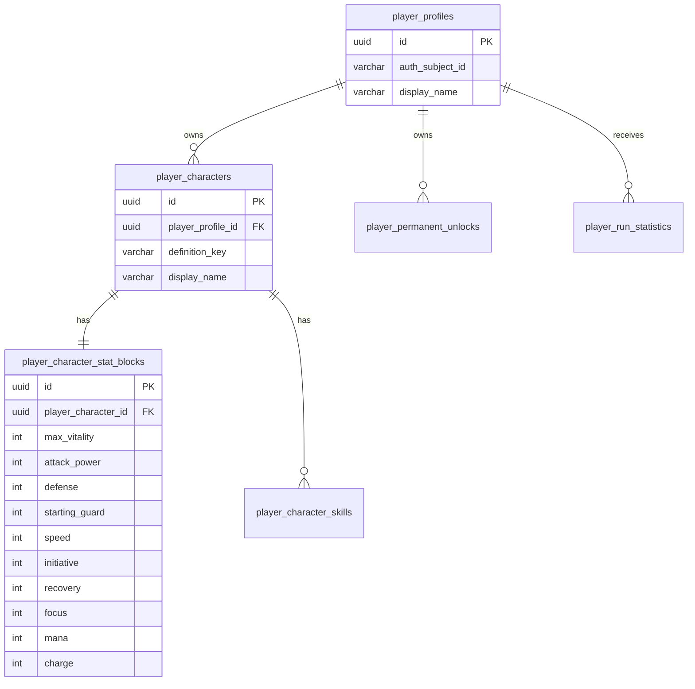

# 05 — Player relational schema

Version: `data-model-0.1-rc2`

## Overview

Player owns permanent gameplay progression. It does not own runtime combat state and does not own Catalog definitions. Player links to Identity only through a stable subject id, without cross-database foreign keys.

## Identity relationship

Target optional field on `player_profiles`:

```text
auth_subject_id VARCHAR(160) NULL
```

Rules:

- Player does not foreign-key to Identity.
- Player stores only the stable authentication subject id.
- Identity owns credentials, MFA, sessions, security, and account lifecycle.
- Player owns gameplay profile, characters, permanent progression, unlocks, and run statistics.
- `auth_subject_id` is the target field name for data-model-0.1.

## player_profiles

| Column | Type | Notes |
|--------|------|-------|
| `id` | UUID PK | player profile id |
| `auth_subject_id` | VARCHAR(160) NULL | stable Identity subject id, no FK |
| `display_name` | VARCHAR(128) NOT NULL | display name |
| `total_runs_started` | INT NOT NULL DEFAULT 0 | lifetime counter |
| `total_runs_completed` | INT NOT NULL DEFAULT 0 | lifetime counter |
| `total_runs_failed` | INT NOT NULL DEFAULT 0 | lifetime counter |
| `total_runs_abandoned` | INT NOT NULL DEFAULT 0 | lifetime counter |
| `created_at_utc` | TIMESTAMPTZ NOT NULL | creation timestamp |
| `updated_at_utc` | TIMESTAMPTZ NOT NULL | update timestamp |

## player_characters

Character identity/display data only. Permanent stats live in `player_character_stat_blocks`.

| Column | Type | Notes |
|--------|------|-------|
| `id` | UUID PK | character id |
| `player_profile_id` | UUID NOT NULL FK | owning profile |
| `definition_key` | VARCHAR(160) NOT NULL | e.g. `character.player.self` |
| `display_name` | VARCHAR(256) NOT NULL | display name |
| `character_type` | VARCHAR(64) NOT NULL DEFAULT 'Standard' | character type |
| `status` | VARCHAR(32) NOT NULL DEFAULT 'Active' | Active, Disabled, Retired |
| `created_at_utc` | TIMESTAMPTZ NOT NULL | creation timestamp |
| `updated_at_utc` | TIMESTAMPTZ NOT NULL | update timestamp |

Unique: `(player_profile_id, definition_key)`.

## player_character_stat_blocks

One-to-one child of `player_characters`. The parent does not carry `stat_block_id`.

| Column | Type | Notes |
|--------|------|-------|
| `id` | UUID PK | stat block id |
| `player_character_id` | UUID UNIQUE NOT NULL FK | parent character |
| `max_vitality` | INT NOT NULL DEFAULT 100 | permanent max vitality |
| `attack_power` | INT NOT NULL DEFAULT 12 | permanent attack |
| `defense` | INT NOT NULL DEFAULT 6 | permanent defense |
| `starting_guard` | INT NOT NULL DEFAULT 0 | permanent starting guard |
| `speed` | INT NOT NULL DEFAULT 10 | permanent speed |
| `initiative` | INT NOT NULL DEFAULT 10 | ATB-ready |
| `recovery` | INT NOT NULL DEFAULT 5 | ATB-ready |
| `focus` | INT NOT NULL DEFAULT 0 | base focus |
| `mana` | INT NOT NULL DEFAULT 0 | base mana |
| `charge` | INT NOT NULL DEFAULT 0 | base charge |

## player_character_skills

Relational replacement for `skill_keys_json`.

| Column | Type | Notes |
|--------|------|-------|
| `id` | UUID PK | row id |
| `player_character_id` | UUID NOT NULL FK | parent character |
| `skill_definition_key` | VARCHAR(160) NOT NULL | Catalog skill key |
| `unlocked_at_utc` | TIMESTAMPTZ NOT NULL | unlock time |
| `source` | VARCHAR(64) NULL | Default, Reward, PermanentUnlock, etc. |

Unique: `(player_character_id, skill_definition_key)`.

## player_permanent_unlocks

Permanent unlocks projected by Game Engine outbox after accepted gameplay events.

| Column | Type | Notes |
|--------|------|-------|
| `id` | UUID PK | unlock row id |
| `player_profile_id` | UUID NOT NULL FK | owning profile |
| `unlock_key` | VARCHAR(160) NOT NULL | stable unlock key |
| `unlock_type` | VARCHAR(64) NOT NULL | Skill, Item, Law, Character, Cosmetic, etc. |
| `source_run_id` | UUID NULL | Game Engine run id, no FK |
| `unlocked_at_utc` | TIMESTAMPTZ NOT NULL | unlock time |

Unique: `(player_profile_id, unlock_key)`.

## player_run_statistics

Future per-run statistics projected from Game Engine. This is not the source for active runs.

| Column | Type | Notes |
|--------|------|-------|
| `id` | UUID PK | statistic row id |
| `player_profile_id` | UUID NOT NULL FK | owning profile |
| `run_id` | UUID UNIQUE NOT NULL | Game Engine run id, no FK |
| `seed` | VARCHAR(128) NOT NULL | run seed |
| `final_depth` | INT NOT NULL | final depth |
| `outcome` | VARCHAR(32) NOT NULL | Completed, Failed, Abandoned |
| `generator_version` | VARCHAR(64) NOT NULL | generator version |
| `started_at_utc` | TIMESTAMPTZ NULL | start time |
| `ended_at_utc` | TIMESTAMPTZ NULL | end time |
| `combats_won` | INT NOT NULL DEFAULT 0 | future metric |
| `combats_lost` | INT NOT NULL DEFAULT 0 | future metric |
| `total_vitality_damage_dealt` | INT NOT NULL DEFAULT 0 | future metric |
| `total_vitality_damage_taken` | INT NOT NULL DEFAULT 0 | future metric |
| `total_guard_absorbed` | INT NOT NULL DEFAULT 0 | future metric |
| `total_healing_done` | INT NOT NULL DEFAULT 0 | future metric |
| `total_items_used` | INT NOT NULL DEFAULT 0 | future metric |

These metrics are projected from backend-authoritative Game Engine data, not frontend meters.

## player_processed_integration_events

Idempotency table for consumed outbox events.

| Column | Type | Notes |
|--------|------|-------|
| `event_id` | UUID PK | integration event id |
| `type` | VARCHAR(128) NOT NULL | event type |
| `processed_at_utc` | TIMESTAMPTZ NOT NULL | processing timestamp |

## ERD


