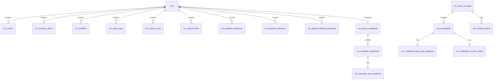

# 06 — Game Engine runtime schema

Version: `data-model-0.1-rc2`

## Overview

Game Engine owns run runtime, snapshots, combat state, reward offers, runtime item snapshots, official combat metrics, and future qualitative Markov/Palace projections. Game Engine does not own Catalog definitions or permanent Player progression.

## Runtime snapshot principles

- Snapshots are immutable after creation.
- Mutable runtime values live in runtime state tables, not snapshot tables.
- `current_vitality` and `current_guard` must not appear in a table named snapshot.
- Game Engine avoids live cross-service reads during active run/combat resolution.
- Stable keys and versions are stored instead of cross-database foreign keys.

## runs

| Column | Type | Notes |
|--------|------|-------|
| `id` | UUID PK | run id |
| `player_id` | UUID NOT NULL | Player profile id reference, no FK |
| `status` | VARCHAR(64) NOT NULL | RunStatus |
| `seed` | VARCHAR(128) NOT NULL | deterministic seed |
| `generator_version` | VARCHAR(64) NOT NULL | generator version |
| `markov_matrix_version` | VARCHAR(64) NULL | version label, no matrix exposure |
| `current_room_index` | INT NOT NULL DEFAULT 0 | room index |
| `active_combat_id` | UUID NULL | active combat reference |
| `pending_reward_offer_id` | UUID NULL | active reward offer |
| `pre_suspend_status` | VARCHAR(64) NULL | status before suspend |
| `started_at_utc` | TIMESTAMPTZ NOT NULL | start time |
| `ended_at_utc` | TIMESTAMPTZ NULL | end time |
| `saved_at_utc` | TIMESTAMPTZ NULL | save time |
| `created_at_utc` | TIMESTAMPTZ NOT NULL | creation timestamp |
| `updated_at_utc` | TIMESTAMPTZ NOT NULL | update timestamp |

## run_rooms

Room instances selected for a run. They snapshot selected Catalog room data enough to remain stable.

| Column | Type | Notes |
|--------|------|-------|
| `id` | UUID PK | room id |
| `run_id` | UUID NOT NULL FK | parent run |
| `room_definition_key` | VARCHAR(160) NULL | Catalog room key |
| `room_definition_version` | VARCHAR(32) NULL | Catalog version |
| `depth` | INT NOT NULL | room depth |
| `room_type` | VARCHAR(64) NOT NULL | runtime room type |
| `room_family` | VARCHAR(64) NULL | snapshotted family |
| `room_rarity` | VARCHAR(64) NULL | snapshotted rarity |
| `theme` | VARCHAR(128) NOT NULL | snapshotted theme |
| `state` | VARCHAR(64) NOT NULL | RoomState |
| `current_node_depth` | INT NOT NULL DEFAULT 0 | current node row |
| `max_node_depth` | INT NOT NULL | maximum row |
| `layout_template_key` | VARCHAR(128) NULL | layout key |
| `layout_template_version` | VARCHAR(64) NULL | layout version |
| `boss_definition_key` | VARCHAR(160) NULL | boss definition key |
| `special_mechanic_key` | VARCHAR(160) NULL | special mechanic key |

## run_map_nodes

Runtime map node instances: `id`, `room_id`, `event_type`, `row`, `lane`, `risk_level`, `reward_profile`, `is_boss`, `state`, `chosen_event_option_id`.

## run_player_snapshots and character snapshots

`run_player_snapshots` stores run-start player display context. `run_character_snapshots` stores run-start character identity. `run_character_stat_snapshots` stores immutable permanent stats copied at run start.

### run_character_stat_snapshots

| Column | Type | Notes |
|--------|------|-------|
| `id` | UUID PK | snapshot id |
| `character_snapshot_id` | UUID UNIQUE NOT NULL FK | parent character snapshot |
| `max_vitality` | INT NOT NULL | immutable run-start value |
| `attack_power` | INT NOT NULL | immutable run-start value |
| `defense` | INT NOT NULL | immutable run-start value |
| `starting_guard` | INT NOT NULL | immutable run-start value |
| `speed` | INT NOT NULL | immutable run-start value |
| `initiative` | INT NOT NULL | ATB-ready |
| `recovery` | INT NOT NULL | ATB-ready |
| `focus` | INT NOT NULL | base focus |
| `mana` | INT NOT NULL | base mana |
| `charge` | INT NOT NULL | base charge |

## run_inventory_items

A RunItem snapshots enough item definition data to remain stable during the run.

```text
definition_key
definition_version
narrative_text
item_type
category
rarity
usage_mode
lifecycle
quantity
max_stack
effect_set_key or effect_summary
is_usable_in_combat
is_usable_outside_combat
source_reward_option_id
acquired_at_utc
```

Target table:

| Column | Type | Notes |
|--------|------|-------|
| `id` | UUID PK | item instance id |
| `run_id` | UUID NOT NULL FK | parent run |
| `definition_key` | VARCHAR(160) NOT NULL | Catalog item key |
| `definition_version` | VARCHAR(32) NOT NULL | Catalog item version |
| `display_name` | VARCHAR(256) NOT NULL | snapshotted display |
| `description` | TEXT NOT NULL | snapshotted description |
| `narrative_text` | TEXT NULL | snapshotted narrative |
| `item_type` | VARCHAR(64) NOT NULL | snapshotted item type |
| `category` | VARCHAR(64) NOT NULL | snapshotted category |
| `rarity` | VARCHAR(64) NOT NULL | snapshotted rarity |
| `usage_mode` | VARCHAR(64) NOT NULL | snapshotted usage mode |
| `lifecycle` | VARCHAR(64) NOT NULL | snapshotted lifecycle |
| `quantity` | INT NOT NULL DEFAULT 1 | runtime quantity |
| `max_stack` | INT NOT NULL DEFAULT 1 | snapshotted max stack |
| `effect_set_key` | VARCHAR(160) NULL | effect set key if available |
| `effect_summary` | TEXT NULL | compact snapshot if full effect rows are not copied |
| `is_usable_in_combat` | BOOLEAN NOT NULL DEFAULT FALSE | combat use |
| `is_usable_outside_combat` | BOOLEAN NOT NULL DEFAULT FALSE | run use |
| `source_reward_option_id` | UUID NULL | source reward option |
| `acquired_at_utc` | TIMESTAMPTZ NOT NULL | acquisition time |

`run_items` is legacy/current-state naming. `run_inventory_items` is the target name.

## run_modifiers, active laws, active curses

Runtime rows created from EffectDefinitions. They store source type/key, value, value mode, duration, stack policy, creation/consumption/expiration timestamps, and optional room/combat expiration references.

## Combat model

### run_active_combats

| Column | Type | Notes |
|--------|------|-------|
| `id` | UUID PK | combat id |
| `run_id` | UUID NOT NULL FK | parent run |
| `room_id` | UUID NOT NULL | room id |
| `node_id` | UUID NULL | node id |
| `status` | VARCHAR(64) NOT NULL | CombatStatus |
| `turn_number` | INT NOT NULL DEFAULT 1 | current turn |
| `active_combatant_id` | UUID NULL | current actor |
| `created_at_utc` | TIMESTAMPTZ NOT NULL | creation timestamp |
| `updated_at_utc` | TIMESTAMPTZ NOT NULL | update timestamp |

### run_combatants

Identity of the combatant in a combat. No duplicated stats.

```text
id UUID PK
combat_id UUID NOT NULL FK
source_key VARCHAR(160) NOT NULL
display_name VARCHAR(256) NOT NULL
side VARCHAR(32) NOT NULL
archetype VARCHAR(128) NOT NULL
status VARCHAR(32) NOT NULL
```

### run_combatant_base_stat_snapshots

Immutable computed base values at combat creation.

```text
id UUID PK
combatant_id UUID UNIQUE NOT NULL FK
max_vitality INT NOT NULL
attack_power INT NOT NULL
starting_guard INT NOT NULL
speed INT NOT NULL
initiative INT NOT NULL
recovery INT NOT NULL
focus INT NOT NULL
mana INT NOT NULL
charge INT NOT NULL
atb_ready_threshold INT NULL
```

### run_combatant_runtime_states

Mutable current values for active combat.

```text
id UUID PK
combatant_id UUID UNIQUE NOT NULL FK
current_vitality INT NOT NULL
current_guard INT NOT NULL
current_focus INT NOT NULL
current_mana INT NOT NULL
current_charge INT NOT NULL
atb_gauge_value INT NULL
updated_at_utc TIMESTAMPTZ NOT NULL
```

### run_combatant_skills

Snapshotted skill availability and combat power/cost: `combatant_id`, `skill_definition_key`, `display_name`, `skill_type`, `targeting_type` for DTO compatibility, `targeting_mode` in future schema, `effect_set_key` or `effect_summary`, `mana_cost`, `charge_cost`, `base_power`, `action_cost`, `cast_time`, `recovery_time`.

## Future official combat metrics

The damage meter frontend current implementation is non-authoritative. Official metrics must be produced by the backend and stored relationally.

`run_combat_actions` should include:

```text
id UUID PK
combat_id UUID NOT NULL FK
turn_number INT NOT NULL
actor_id UUID NOT NULL
skill_key VARCHAR(160) NULL
item_key VARCHAR(160) NULL
target_ids TEXT NOT NULL DEFAULT '[]'
raw_damage INT NOT NULL DEFAULT 0
mitigated_damage INT NOT NULL DEFAULT 0
vitality_damage INT NOT NULL DEFAULT 0
guard_damage INT NOT NULL DEFAULT 0
guard_absorbed INT NOT NULL DEFAULT 0
guard_gained INT NOT NULL DEFAULT 0
damage_taken INT NOT NULL DEFAULT 0
healing_done INT NOT NULL DEFAULT 0
healing_received INT NOT NULL DEFAULT 0
source_type VARCHAR(64) NULL
source_key VARCHAR(160) NULL
target_snapshot_json TEXT NULL only if strictly necessary for audit/debug
occurred_at_utc TIMESTAMPTZ NOT NULL
```

Avoid JSON for primary metrics. These metrics can later feed combat recap, run recap, player statistics, achievements, balancing, internal analytics, and post-combat UI.

## Runtime adaptive projections

Markov internals are not documented here. No raw matrix or raw probabilities are stored for frontend display. Game Engine may store qualitative traces and projections.

### run_adaptive_influences

```text
id UUID PK
run_id UUID NOT NULL FK
source_type VARCHAR(64) NOT NULL
source_key VARCHAR(160) NOT NULL
influence_type VARCHAR(64) NOT NULL
influence_tag VARCHAR(128) NOT NULL
value DECIMAL(10,4) NULL
value_mode VARCHAR(32) NULL
duration VARCHAR(64) NOT NULL
created_at_utc TIMESTAMPTZ NOT NULL
consumed_at_utc TIMESTAMPTZ NULL
```

Examples: `behavior.paranoid`, `generation.alchemical`, `pressure.hostile`, `reward.defensive_bias`, `enemy.echo_bias`.

### run_selection_decisions

```text
id UUID PK
run_id UUID NOT NULL FK
decision_type VARCHAR(64) NOT NULL
context_key VARCHAR(160) NULL
selected_key VARCHAR(160) NOT NULL
selection_group VARCHAR(64) NULL
matrix_version VARCHAR(64) NULL
seed VARCHAR(128) NOT NULL
created_at_utc TIMESTAMPTZ NOT NULL
```

Do not store raw probabilities by default.

### run_palace_pressure_snapshots

Stores backend-derived pressure state such as intensity, dominant tags, and narrative label. No raw matrix details.

### run_palace_indicator_snapshots

```text
id UUID PK
run_id UUID NOT NULL FK
indicator_key VARCHAR(160) NOT NULL
display_label VARCHAR(256) NOT NULL
narrative_text TEXT NOT NULL
intensity VARCHAR(64) NOT NULL
source_decision_id UUID NULL
created_at_utc TIMESTAMPTZ NOT NULL
expires_at_utc TIMESTAMPTZ NULL
```

Frontend examples:

- Le Palais se crispe.
- Les echos deviennent mefiants.
- Une salle instable approche.
- La Loi pese sur les choix du Palais.

## Reward offers

`run_reward_offers` and `run_reward_options` snapshot reward options at offer creation. Use `RewardOption` as the target concept name. `RewardChoice` is legacy wording.

## ERD excerpt


