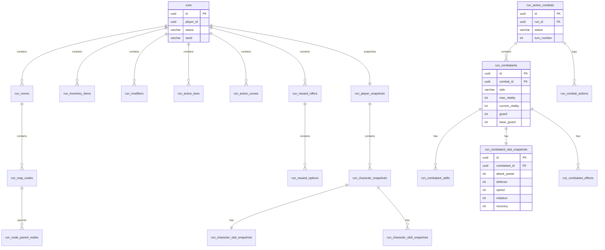

# 06 — Game Engine runtime schema

## Overview

The Game Engine service owns run and combat runtime state. This document defines the target relational schema for all Game Engine tables.

## runs

Root aggregate for a single player run.

| Column | Type | Nullable | Default | Description |
|--------|------|----------|---------|-------------|
| `id` | UUID | NOT NULL | gen_random_uuid() | Primary key |
| `player_id` | UUID | NOT NULL | — | Player ID (reference, no FK) |
| `status` | VARCHAR(64) | NOT NULL | — | RunStatus enum value |
| `seed` | VARCHAR(128) | NOT NULL | — | Deterministic seed |
| `generator_version` | VARCHAR(64) | NOT NULL | — | Generator version |
| `markov_matrix_version` | VARCHAR(64) | NOT NULL | — | Markov matrix version |
| `current_room_index` | INT | NOT NULL | 0 | Index of current room |
| `active_combat_id` | UUID | NULL | NULL | FK → `run_active_combats.id` (nullable) |
| `pending_reward_offer_id` | UUID | NULL | NULL | Reference to active reward offer |
| `pre_suspend_status` | VARCHAR(64) | NULL | NULL | Status before suspension |
| `started_at_utc` | TIMESTAMPTZ | NOT NULL | now() | Run start time |
| `ended_at_utc` | TIMESTAMPTZ | NULL | NULL | Run end time |
| `saved_at_utc` | TIMESTAMPTZ | NULL | NULL | Last save time |
| `created_at_utc` | TIMESTAMPTZ | NOT NULL | now() | Creation timestamp |
| `updated_at_utc` | TIMESTAMPTZ | NOT NULL | now() | Last update timestamp |

**Primary key:** `id`
**Indexes:** `player_id`, `status`, `created_at_utc`
**Relations:** 1:N → `run_rooms`; 1:N → `run_inventory_items`; 1:N → `run_modifiers`; 1:N → `run_active_laws`; 1:N → `run_active_curses`; 1:1 → `run_player_snapshots`; 1:1 → `run_active_combats` (nullable)

---

## run_rooms

Rooms within a run.

| Column | Type | Nullable | Default | Description |
|--------|------|----------|---------|-------------|
| `id` | UUID | NOT NULL | gen_random_uuid() | Primary key |
| `run_id` | UUID | NOT NULL | — | FK → `runs.id` (CASCADE) |
| `depth` | INT | NOT NULL | — | Room depth (0–10) |
| `room_type` | VARCHAR(64) | NOT NULL | — | RoomType enum value |
| `theme` | VARCHAR(128) | NOT NULL | — | Room theme |
| `boss_id` | VARCHAR(128) | NOT NULL | — | Boss definition key |
| `boss_name` | VARCHAR(256) | NOT NULL | — | Boss display name |
| `boss_room_type` | VARCHAR(64) | NOT NULL | — | Boss room type |
| `boss_danger_hint` | VARCHAR(512) | NOT NULL | — | Boss danger hint text |
| `boss_enemy_template_key` | VARCHAR(128) | NOT NULL | — | Boss enemy template key |
| `state` | VARCHAR(64) | NOT NULL | — | RoomState enum value |
| `current_node_depth` | INT | NOT NULL | 0 | Current node row depth |
| `max_node_depth` | INT | NOT NULL | — | Maximum node row depth |
| `layout_template_key` | VARCHAR(128) | NULL | NULL | Layout template reference |
| `layout_template_version` | VARCHAR(64) | NULL | NULL | Layout template version |

**Primary key:** `id`
**Indexes:** `run_id`, `state`
**Relations:** FK → `runs.id` (N:1, CASCADE); 1:N → `run_map_nodes`

---

## run_map_nodes

Map nodes within a room.

| Column | Type | Nullable | Default | Description |
|--------|------|----------|---------|-------------|
| `id` | UUID | NOT NULL | gen_random_uuid() | Primary key |
| `room_id` | UUID | NOT NULL | — | FK → `run_rooms.id` (CASCADE) |
| `event_type` | VARCHAR(64) | NOT NULL | — | NodeEventType enum value |
| `row` | INT | NOT NULL | — | Row position in map |
| `lane` | INT | NOT NULL | — | Lane position in map |
| `risk_level` | INT | NOT NULL | — | Risk level (0–100) |
| `reward_profile` | VARCHAR(128) | NOT NULL | — | Reward profile key |
| `is_boss` | BOOLEAN | NOT NULL | FALSE | Whether this is the boss node |
| `state` | VARCHAR(64) | NOT NULL | — | NodeState enum value |
| `chosen_event_option_id` | VARCHAR(128) | NULL | NULL | Selected event option |

**Primary key:** `id`
**Indexes:** `room_id`, `state`, `row`
**Relations:** FK → `run_rooms.id` (N:1, CASCADE); N:M via `run_node_parent_nodes`

---

## run_node_parent_nodes

Junction table for node DAG parent relationships.

| Column | Type | Nullable | Default | Description |
|--------|------|----------|---------|-------------|
| `map_node_id` | UUID | NOT NULL | — | FK → `run_map_nodes.id` (CASCADE) |
| `parent_node_id` | UUID | NOT NULL | — | FK → `run_map_nodes.id` |

**Primary key:** composite `(map_node_id, parent_node_id)`
**Indexes:** `map_node_id`, `parent_node_id`

---

## run_player_snapshots

Snapshot of player permanent stats at run start. Prevents mid-run stat changes from affecting active run.

| Column | Type | Nullable | Default | Description |
|--------|------|----------|---------|-------------|
| `id` | UUID | NOT NULL | gen_random_uuid() | Primary key |
| `run_id` | UUID | NOT NULL | — | FK → `runs.id` (UNIQUE, CASCADE) |
| `player_id` | UUID | NOT NULL | — | Player ID (reference) |
| `display_name` | VARCHAR(256) | NOT NULL | — | Player display name |
| `created_at_utc` | TIMESTAMPTZ | NOT NULL | now() | Snapshot creation time |

**Primary key:** `id`
**Unique constraints:** `run_id`
**Relations:** FK → `runs.id` (1:1, CASCADE); 1:N → `run_character_snapshots`

---

## run_character_snapshots

Snapshot of player characters at run start.

| Column | Type | Nullable | Default | Description |
|--------|------|----------|---------|-------------|
| `id` | UUID | NOT NULL | gen_random_uuid() | Primary key |
| `player_snapshot_id` | UUID | NOT NULL | — | FK → `run_player_snapshots.id` (CASCADE) |
| `character_id` | UUID | NOT NULL | — | Original character ID |
| `definition_key` | VARCHAR(160) | NOT NULL | — | Character definition key |
| `display_name` | VARCHAR(256) | NOT NULL | — | Character display name |

**Primary key:** `id`
**Indexes:** `player_snapshot_id`
**Relations:** FK → `run_player_snapshots.id` (N:1, CASCADE); 1:1 → `run_character_stat_snapshots`; 1:N → `run_character_skill_snapshots`

---

## run_character_stat_snapshots

Snapshot of character permanent stats at run start.

| Column | Type | Nullable | Default | Description |
|--------|------|----------|---------|-------------|
| `id` | UUID | NOT NULL | gen_random_uuid() | Primary key |
| `character_snapshot_id` | UUID | NOT NULL | — | FK → `run_character_snapshots.id` (UNIQUE, CASCADE) |
| `max_vitality` | INT | NOT NULL | — | Snapshotted max vitality |
| `attack_power` | INT | NOT NULL | — | Snapshotted attack power |
| `defense` | INT | NOT NULL | — | Snapshotted defense |
| `starting_guard` | INT | NOT NULL | — | Snapshotted starting guard |
| `speed` | INT | NOT NULL | — | Snapshotted speed |
| `initiative` | INT | NOT NULL | — | Snapshotted initiative |
| `recovery` | INT | NOT NULL | — | Snapshotted recovery |
| `focus` | INT | NOT NULL | — | Snapshotted focus |
| `mana` | INT | NOT NULL | — | Snapshotted mana |
| `charge` | INT | NOT NULL | — | Snapshotted charge |

**Primary key:** `id`
**Unique constraints:** `character_snapshot_id`
**Relations:** FK → `run_character_snapshots.id` (1:1, CASCADE)

---

## run_character_skill_snapshots

Snapshot of character skills at run start.

| Column | Type | Nullable | Default | Description |
|--------|------|----------|---------|-------------|
| `id` | UUID | NOT NULL | gen_random_uuid() | Primary key |
| `character_snapshot_id` | UUID | NOT NULL | — | FK → `run_character_snapshots.id` (CASCADE) |
| `skill_definition_key` | VARCHAR(160) | NOT NULL | — | Skill definition key |
| `display_name` | VARCHAR(256) | NOT NULL | — | Skill display name |
| `skill_type` | VARCHAR(64) | NOT NULL | — | Skill type |
| `targeting_type` | VARCHAR(64) | NOT NULL | — | Targeting type |
| `effect_type` | VARCHAR(64) | NOT NULL | — | Effect type |
| `mana_cost` | INT | NOT NULL | 0 | Mana cost |
| `charge_cost` | INT | NOT NULL | 0 | Charge cost |
| `base_power` | INT | NOT NULL | 0 | Base power |

**Primary key:** `id`
**Indexes:** `character_snapshot_id`, `skill_definition_key`
**Relations:** FK → `run_character_snapshots.id` (N:1, CASCADE)

---

## run_inventory_items

Items in the player's run inventory.

| Column | Type | Nullable | Default | Description |
|--------|------|----------|---------|-------------|
| `id` | UUID | NOT NULL | gen_random_uuid() | Primary key |
| `run_id` | UUID | NOT NULL | — | FK → `runs.id` (CASCADE) |
| `definition_key` | VARCHAR(160) | NOT NULL | — | Item definition key |
| `display_name` | VARCHAR(256) | NOT NULL | — | Item display name |
| `description` | TEXT | NOT NULL | — | Item description |
| `item_type` | VARCHAR(64) | NOT NULL | — | Item type |
| `category` | VARCHAR(64) | NOT NULL | — | Item category |
| `rarity` | VARCHAR(64) | NOT NULL | — | Item rarity |
| `quantity` | INT | NOT NULL | 1 | Stack quantity |
| `effect_type` | VARCHAR(64) | NULL | NULL | Primary effect type |
| `effect_amount` | INT | NULL | NULL | Primary effect amount |
| `is_usable_in_combat` | BOOLEAN | NOT NULL | FALSE | Whether usable in combat |
| `source_reward_option_id` | UUID | NULL | NULL | Source reward option reference |
| `acquired_at_utc` | TIMESTAMPTZ | NOT NULL | now() | When item was acquired |

**Primary key:** `id`
**Indexes:** `run_id`, `definition_key`
**Relations:** FK → `runs.id` (N:1, CASCADE)

---

## run_modifiers

Persistent modifiers active on a run.

| Column | Type | Nullable | Default | Description |
|--------|------|----------|---------|-------------|
| `id` | UUID | NOT NULL | gen_random_uuid() | Primary key |
| `run_id` | UUID | NOT NULL | — | FK → `runs.id` (CASCADE) |
| `type` | VARCHAR(64) | NOT NULL | — | RunModifierType enum value |
| `value` | DECIMAL(10,4) | NOT NULL | — | Modifier value |
| `value_mode` | VARCHAR(32) | NOT NULL | 'Flat' | ValueMode enum value |
| `duration` | VARCHAR(64) | NOT NULL | — | RunModifierDuration enum value |
| `stack_policy` | VARCHAR(64) | NOT NULL | 'Additive' | StackPolicy enum value |
| `source_type` | VARCHAR(64) | NOT NULL | — | Source type (RunItem, Curse, PalaceLaw, etc.) |
| `source_key` | VARCHAR(256) | NOT NULL | — | Source definition key |
| `created_at_utc` | TIMESTAMPTZ | NOT NULL | now() | Creation timestamp |
| `consumed_at_utc` | TIMESTAMPTZ | NULL | NULL | When modifier was consumed |
| `expires_at_room_id` | UUID | NULL | NULL | Room ID at which modifier expires |
| `expires_at_combat_id` | UUID | NULL | NULL | Combat ID at which modifier expires |

**Primary key:** `id`
**Indexes:** `run_id`, `type`, `consumed_at_utc`
**Relations:** FK → `runs.id` (N:1, CASCADE)

---

## run_active_laws

Palace laws active on a run.

| Column | Type | Nullable | Default | Description |
|--------|------|----------|---------|-------------|
| `id` | UUID | NOT NULL | gen_random_uuid() | Primary key |
| `run_id` | UUID | NOT NULL | — | FK → `runs.id` (CASCADE) |
| `law_definition_key` | VARCHAR(160) | NOT NULL | — | Law definition key |
| `display_name` | VARCHAR(256) | NOT NULL | — | Law display name |
| `description` | TEXT | NOT NULL | — | Law description |
| `duration` | VARCHAR(64) | NOT NULL | — | Duration |
| `applied_at_utc` | TIMESTAMPTZ | NOT NULL | now() | When law was accepted |
| `expires_at_room_id` | UUID | NULL | NULL | Room at which law expires |
| `consumed_at_utc` | TIMESTAMPTZ | NULL | NULL | When law was consumed |

**Primary key:** `id`
**Indexes:** `run_id`, `law_definition_key`
**Relations:** FK → `runs.id` (N:1, CASCADE)

---

## run_active_curses

Curses active on a run. Currently does not have a dedicated table.

| Column | Type | Nullable | Default | Description |
|--------|------|----------|---------|-------------|
| `id` | UUID | NOT NULL | gen_random_uuid() | Primary key |
| `run_id` | UUID | NOT NULL | — | FK → `runs.id` (CASCADE) |
| `curse_definition_key` | VARCHAR(160) | NOT NULL | — | Curse definition key |
| `display_name` | VARCHAR(256) | NOT NULL | — | Curse display name |
| `description` | TEXT | NOT NULL | — | Curse description |
| `duration` | VARCHAR(64) | NOT NULL | — | Duration |
| `applied_at_utc` | TIMESTAMPTZ | NOT NULL | now() | When curse was accepted |
| `expires_at_room_id` | UUID | NULL | NULL | Room at which curse expires |
| `consumed_at_utc` | TIMESTAMPTZ | NULL | NULL | When curse was consumed |

**Primary key:** `id`
**Indexes:** `run_id`, `curse_definition_key`
**Relations:** FK → `runs.id` (N:1, CASCADE)

**Current state:** `ActiveCurse` exists as a domain entity on `Run` but is NOT persisted as a separate table. It is serialized into the run aggregate.

---

## run_active_combats

Active combat encounter within a run.

| Column | Type | Nullable | Default | Description |
|--------|------|----------|---------|-------------|
| `id` | UUID | NOT NULL | gen_random_uuid() | Primary key |
| `run_id` | UUID | NOT NULL | — | FK → `runs.id` |
| `room_id` | UUID | NOT NULL | — | Room where combat occurs |
| `node_id` | UUID | NOT NULL | — | Node where combat occurs |
| `status` | VARCHAR(64) | NOT NULL | — | CombatStatus enum value |
| `turn_number` | INT | NOT NULL | 1 | Current turn number |
| `active_combatant_id` | UUID | NULL | NULL | Currently active combatant |
| `created_at_utc` | TIMESTAMPTZ | NOT NULL | now() | Creation timestamp |
| `updated_at_utc` | TIMESTAMPTZ | NOT NULL | now() | Last update timestamp |

**Primary key:** `id`
**Indexes:** `run_id`, `status`
**Relations:** 1:N → `run_combatants`

---

## run_combatants

Combatants participating in a combat encounter.

| Column | Type | Nullable | Default | Description |
|--------|------|----------|---------|-------------|
| `id` | UUID | NOT NULL | gen_random_uuid() | Primary key |
| `combat_id` | UUID | NOT NULL | — | FK → `run_active_combats.id` (CASCADE) |
| `source_key` | VARCHAR(160) | NOT NULL | — | Source definition key |
| `display_name` | VARCHAR(256) | NOT NULL | — | Display name |
| `side` | VARCHAR(32) | NOT NULL | — | CombatantSide enum value |
| `archetype` | VARCHAR(128) | NOT NULL | — | Combatant archetype |
| `max_vitality` | INT | NOT NULL | — | Max vitality (snapshotted + scaled) |
| `current_vitality` | INT | NOT NULL | — | Current vitality (mutable) |
| `guard` | INT | NOT NULL | 0 | Current guard (mutable) |
| `base_guard` | INT | NOT NULL | 0 | Guard floor (reset each round) |
| `mana` | INT | NOT NULL | 0 | Current mana |
| `charge` | INT | NOT NULL | 0 | Current charge |
| `status` | VARCHAR(32) | NOT NULL | — | CombatantStatus enum value |

**Primary key:** `id`
**Indexes:** `combat_id`, `side`, `status`
**Relations:** FK → `run_active_combats.id` (N:1, CASCADE); 1:N → `run_combatant_skills`

---

## run_combatant_skills

Skills available to a combatant.

| Column | Type | Nullable | Default | Description |
|--------|------|----------|---------|-------------|
| `id` | UUID | NOT NULL | gen_random_uuid() | Primary key |
| `combatant_id` | UUID | NOT NULL | — | FK → `run_combatants.id` (CASCADE) |
| `key` | VARCHAR(128) | NOT NULL | — | Skill definition key |
| `display_name` | VARCHAR(256) | NOT NULL | — | Skill display name |
| `skill_type` | VARCHAR(64) | NOT NULL | — | Skill type |
| `targeting_type` | VARCHAR(64) | NOT NULL | — | Targeting type |
| `effect_type` | VARCHAR(64) | NOT NULL | — | Effect type |
| `mana_cost` | INT | NOT NULL | 0 | Mana cost |
| `charge_cost` | INT | NOT NULL | 0 | Charge cost |
| `base_power` | INT | NOT NULL | 0 | Base power |
| `tags` | TEXT | NOT NULL | '[]' | JSON array of tags |

**Primary key:** `id`
**Indexes:** `combatant_id`, `key`
**Relations:** FK → `run_combatants.id` (N:1, CASCADE)

---

## run_combatant_stat_snapshots

Computed stat snapshot for a combatant at combat creation. Stores the final values after applying difficulty scaling and RunModifiers.

| Column | Type | Nullable | Default | Description |
|--------|------|----------|---------|-------------|
| `id` | UUID | NOT NULL | gen_random_uuid() | Primary key |
| `combatant_id` | UUID | NOT NULL | — | FK → `run_combatants.id` (UNIQUE, CASCADE) |
| `max_vitality` | INT | NOT NULL | — | Computed max vitality |
| `current_vitality` | INT | NOT NULL | — | Initialized to max_vitality |
| `attack_power` | INT | NOT NULL | — | Computed attack power |
| `defense` | INT | NOT NULL | — | Computed defense |
| `starting_guard` | INT | NOT NULL | — | Computed starting guard |
| `current_guard` | INT | NOT NULL | — | Initialized to starting_guard |
| `speed` | INT | NOT NULL | — | Computed speed |
| `initiative` | INT | NOT NULL | — | Computed initiative (ATB-ready) |
| `recovery` | INT | NOT NULL | — | Computed recovery (ATB-ready) |
| `focus` | INT | NOT NULL | 0 | Computed focus |
| `atb_gauge_value` | INT | NULL | NULL | ATB gauge position (future) |
| `atb_ready_threshold` | INT | NULL | NULL | ATB threshold to act (future) |
| `action_recovery_until_tick` | INT | NULL | NULL | ATB tick when recovery ends (future) |

**Primary key:** `id`
**Unique constraints:** `combatant_id`
**Relations:** FK → `run_combatants.id` (1:1, CASCADE)

---

## run_combatant_effects

Transient effects active on a combatant during combat.

| Column | Type | Nullable | Default | Description |
|--------|------|----------|---------|-------------|
| `id` | UUID | NOT NULL | gen_random_uuid() | Primary key |
| `combatant_id` | UUID | NOT NULL | — | FK → `run_combatants.id` (CASCADE) |
| `effect_type` | VARCHAR(64) | NOT NULL | — | EffectType enum value |
| `value` | DECIMAL(10,4) | NOT NULL | — | Effect value |
| `value_mode` | VARCHAR(32) | NOT NULL | 'Flat' | ValueMode |
| `duration` | VARCHAR(64) | NOT NULL | — | Duration |
| `stack_policy` | VARCHAR(32) | NOT NULL | 'None' | Stack policy |
| `source_key` | VARCHAR(256) | NULL | NULL | Source skill/item key |
| `created_at_tick` | INT | NULL | NULL | ATB tick when created (future) |
| `expires_at_tick` | INT | NULL | NULL | ATB tick when expires (future) |
| `created_at_utc` | TIMESTAMPTZ | NOT NULL | now() | Creation timestamp |

**Primary key:** `id`
**Indexes:** `combatant_id`, `effect_type`
**Relations:** FK → `run_combatants.id` (N:1, CASCADE)

---

## run_combat_actions

Log of all combat actions for replay and audit.

| Column | Type | Nullable | Default | Description |
|--------|------|----------|---------|-------------|
| `id` | UUID | NOT NULL | gen_random_uuid() | Primary key |
| `combat_id` | UUID | NOT NULL | — | FK → `run_active_combats.id` (CASCADE) |
| `turn_number` | INT | NOT NULL | — | Turn when action occurred |
| `actor_id` | UUID | NOT NULL | — | Combatant who acted |
| `skill_key` | VARCHAR(128) | NOT NULL | — | Skill used |
| `target_ids` | TEXT | NOT NULL | '[]' | JSON array of target combatant IDs |
| `damage_dealt` | INT | NOT NULL | 0 | Total damage dealt |
| `healing_done` | INT | NOT NULL | 0 | Total healing done |
| `effects_applied` | TEXT | NOT NULL | '[]' | JSON array of effects applied |
| `occurred_at_utc` | TIMESTAMPTZ | NOT NULL | now() | Timestamp |

**Primary key:** `id`
**Indexes:** `combat_id`, `turn_number`, `actor_id`
**Relations:** FK → `run_active_combats.id` (N:1, CASCADE)

---

## run_reward_offers

Reward offers presented to the player.

| Column | Type | Nullable | Default | Description |
|--------|------|----------|---------|-------------|
| `id` | UUID | NOT NULL | gen_random_uuid() | Primary key |
| `run_id` | UUID | NOT NULL | — | FK → `runs.id` (CASCADE) |
| `source` | VARCHAR(64) | NOT NULL | — | RewardSource enum value |
| `state` | VARCHAR(32) | NOT NULL | — | RewardOfferState enum value |
| `combat_tier` | VARCHAR(32) | NULL | NULL | CombatTier if combat-scaled |
| `difficulty_multiplier` | DECIMAL(10,4) | NULL | NULL | Scaling multiplier |
| `reward_power_multiplier` | DECIMAL(10,4) | NULL | NULL | Reward scaling |
| `created_at_utc` | TIMESTAMPTZ | NOT NULL | now() | Creation timestamp |

**Primary key:** `id`
**Indexes:** `run_id`, `state`
**Relations:** FK → `runs.id` (N:1, CASCADE); 1:N → `run_reward_options`

---

## run_reward_options

Individual choices within a reward offer.

| Column | Type | Nullable | Default | Description |
|--------|------|----------|---------|-------------|
| `id` | UUID | NOT NULL | gen_random_uuid() | Primary key |
| `reward_offer_id` | UUID | NOT NULL | — | FK → `run_reward_offers.id` (CASCADE) |
| `reward_type` | VARCHAR(64) | NOT NULL | — | RewardType enum value |
| `label` | VARCHAR(256) | NOT NULL | — | Display label |
| `description` | TEXT | NOT NULL | — | Description |
| `payload_key` | VARCHAR(256) | NOT NULL | — | Payload reference |
| `is_selected` | BOOLEAN | NOT NULL | FALSE | Whether this option was selected |

**Primary key:** `id`
**Indexes:** `reward_offer_id`
**Relations:** FK → `run_reward_offers.id` (N:1, CASCADE)

---

## game_engine_outbox_messages

Outbox pattern for reliable integration events to Player service.

| Column | Type | Nullable | Default | Description |
|--------|------|----------|---------|-------------|
| `id` | UUID | NOT NULL | gen_random_uuid() | Primary key |
| `type` | VARCHAR(128) | NOT NULL | — | Event type |
| `event_version` | VARCHAR(32) | NOT NULL | 'v1' | Event version |
| `payload_json` | TEXT | NOT NULL | — | JSON payload |
| `occurred_at_utc` | TIMESTAMPTZ | NOT NULL | — | When event occurred |
| `created_at_utc` | TIMESTAMPTZ | NOT NULL | now() | When message was created |
| `processed_at_utc` | TIMESTAMPTZ | NULL | NULL | When message was dispatched |
| `retry_count` | INT | NOT NULL | 0 | Number of delivery attempts |
| `last_error` | TEXT | NULL | NULL | Last error message |
| `correlation_id` | UUID | NULL | NULL | Correlation ID |
| `causation_id` | UUID | NULL | NULL | Causation ID |
| `destination` | VARCHAR(128) | NULL | NULL | Target service |

**Primary key:** `id`
**Indexes:** `processed_at_utc`, `type`, `occurred_at_utc`

**Current state:** Implemented.

---

## ERD (Game Engine)

