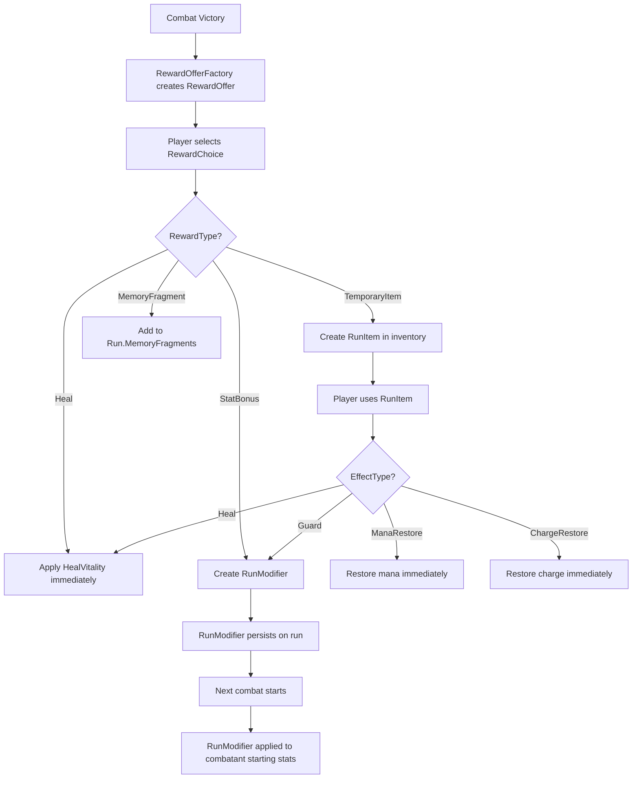
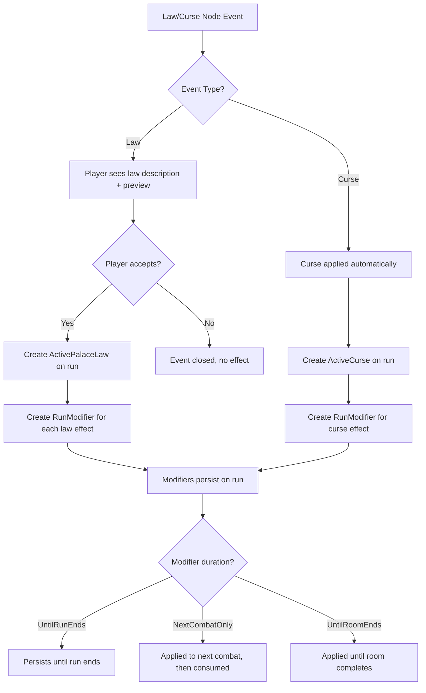

# 07 — Reward, item, law, curse model

## Overview

This document defines how rewards, items, laws, and curses flow through the system, from Catalog definition to runtime effect.

## Entity definitions

### RewardOffer

**Owner:** Game Engine
**Lifecycle:** Created after combat victory or event resolution; expires after selection or room exit.

A `RewardOffer` presents the player with a set of `RewardChoice` options. Created by `RewardOfferFactory` based on the event source and optional `CombatRiskProfile` scaling.

### RewardChoice

**Owner:** Game Engine
**Lifecycle:** Part of a RewardOffer; immutable after creation.

A single option within a RewardOffer. Contains `RewardType`, `Label`, `Description`, and `PayloadKey`.

### RunItem

**Owner:** Game Engine
**Lifecycle:** Created when player acquires an item during a run; persists until consumed or run ends.

A runtime instance of an item. Snapshots display info from Catalog at acquisition time. Contains `EffectType` and `EffectAmount` for immediate application.

### RunModifier

**Owner:** Game Engine
**Lifecycle:** Created by items, laws, curses, or rewards; persists until duration expires or is consumed.

A persistent modifier on the run. Applies its effect at the appropriate lifecycle point (combat start, round start, reward calculation).

### ActivePalaceLaw

**Owner:** Game Engine
**Lifecycle:** Created when player accepts a law; persists until run ends or law-specific duration expires.

Records which palace law is active on the run. Associated `RunModifier`s are created simultaneously.

### ActiveCurse

**Owner:** Game Engine
**Lifecycle:** Created when player encounters a curse node; persists until consumed or run ends.

Records which curse is active on the run. Associated `RunModifier`s are created simultaneously.

## Flow diagrams

### Reward → Item → Modifier → Combat effect



### Law/Curse → Modifier → Combat/Reward effect



## Narrative examples

### Éclat de garde (Guard Shard)

```text
Source:     RewardOption after combat victory
Definition: item.consumable.ecart-de-garde (Catalog, future)
Flow:
  1. Player defeats Fragment de Doute → RewardOffer created
  2. RewardOffer includes "Éclat de garde" (RewardType = TemporaryItem)
  3. Player selects → RunItem created:
     - definition_key = "item.consumable.ecart-de-garde"
     - effect_type = AddStartingGuard
     - effect_amount = 8
  4. Player uses item outside combat → RunModifier created:
     - type = StartingGuardBonus
     - value = 8
     - value_mode = Flat
     - duration = UntilRunEnds
     - stack_policy = Additive
  5. Next combat: effective_starting_guard = 0 + 8 = 8
  6. Second Éclat: +8 more → effective_starting_guard = 16
  7. Capped at MaxStartingGuardBonus = 30
```

### Baume de mémoire (Memory Balm)

```text
Source:     Merchant event or item node
Definition: item.consumable.baume-de-memoire (Catalog, future)
Flow:
  1. Player acquires item → RunItem created:
     - definition_key = "item.consumable.baume-de-memoire"
     - effect_type = HealVitality
     - effect_amount = 25
  2. Player uses in combat → current_vitality += 25 (capped at max_vitality)
  3. Quantity decremented by 1
  4. No RunModifier created (Immediate effect)
```

### Souffle Lourd (Heavy Breath — Curse)

```text
Source:     Curse node event
Definition: curse.threshold.souffle-lourd (Catalog, future)
Flow:
  1. Player encounters curse node → ResolveCurrentEvent
  2. CurseDefinition: severity=1, effects=[ModifyDifficultyMultiplier +0.10]
  3. ActiveCurse created:
     - key = "curse.threshold.souffle-lourd"
     - display_name = "Souffle Lourd"
     - difficulty_delta = +0.10
  4. RunModifier created:
     - type = NextCombatDifficultyMultiplier
     - value = 0.10
     - duration = NextCombatOnly
     - source_type = Curse
  5. Next combat: difficulty_multiplier = 1.0 + 0.10 = 1.10
  6. Enemy stats scaled by ×1.10
  7. After combat: modifier consumed, ActiveCurse cleared
```

### Le Poids du Silence (The Weight of Silence — Law)

```text
Source:     Law node event
Definition: law.threshold.silence-weight (Catalog)
Flow:
  1. Player encounters law node → sees description + effect preview
  2. Player accepts → ActivePalaceLaw created:
     - key = "law.threshold.silence-weight"
     - display_name = "Le Poids du Silence"
  3. Two RunModifiers created:
     a. StartingGuardBonus +5, UntilRunEnds, Additive
     b. PermanentCombatDifficultyBonus +0.05, UntilRunEnds, Additive
  4. All subsequent combats:
     - starting_guard += 5
     - difficulty_multiplier += 0.05
  5. Persists until run ends (completed/failed/abandoned)
```

### Don Terni (Tarnished Gift — NPC reward)

```text
Source:     NPC event with reward
Definition: npc reward (Catalog, future)
Flow:
  1. Player meets NPC → interaction resolved
  2. NPC offers "Don Terni" as reward
  3. RewardType = TemporaryItem, payload = "item.consumable.don-terni"
  4. RunItem created with HealVitality +15
  5. Usable in or out of combat
```

### Éclat retrouvé (Rediscovered Shard — Rest event)

```text
Source:     Rest node event
Flow:
  1. Player selects rest node → ResolveCurrentEvent
  2. Rest event resolves: recovery_ratio = 30 (percent of max_vitality)
  3. HealVitality applied: current_vitality += max_vitality * 0.30
  4. No RunModifier created (Immediate effect)
```

## Duration expiration rules

| Duration | Expires when | Behavior |
|----------|-------------|----------|
| `Immediate` | Applied once | No persistence |
| `CurrentCombat` | Combat ends | Cleared when combat completes/fails |
| `NextCombatOnly` | Next combat ends | Consumed after next combat |
| `NextRewardOnly` | Next reward selected | Consumed after next reward selection |
| `UntilRoomEnds` | Current room completes | Cleared when room state = Completed |
| `UntilRunEnds` | Run ends | Cleared when run = Completed/Failed/Abandoned |
| `PermanentCandidate` | Run completes successfully | Projected to Player via outbox |

## Stack policy rules

| Policy | Behavior | Example |
|--------|----------|---------|
| `None` | New instance rejected if one exists | Unique curse |
| `Additive` | Values summed | +8 guard + +5 guard = +13 guard |
| `HighestOnly` | Only highest value active | Multiple speed buffs |
| `RefreshDuration` | New instance refreshes timer | Temporary buff re-application |
| `Replace` | New instance replaces old | Curse replacement |
