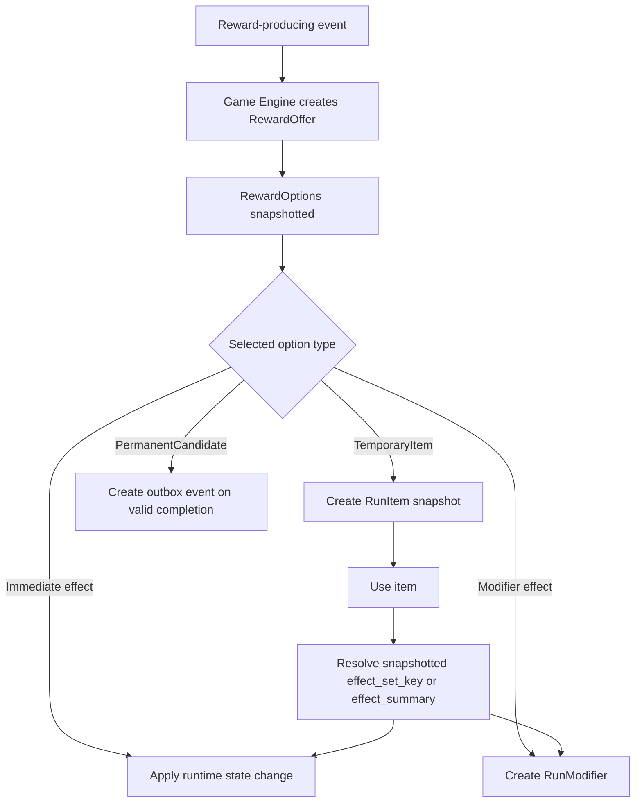
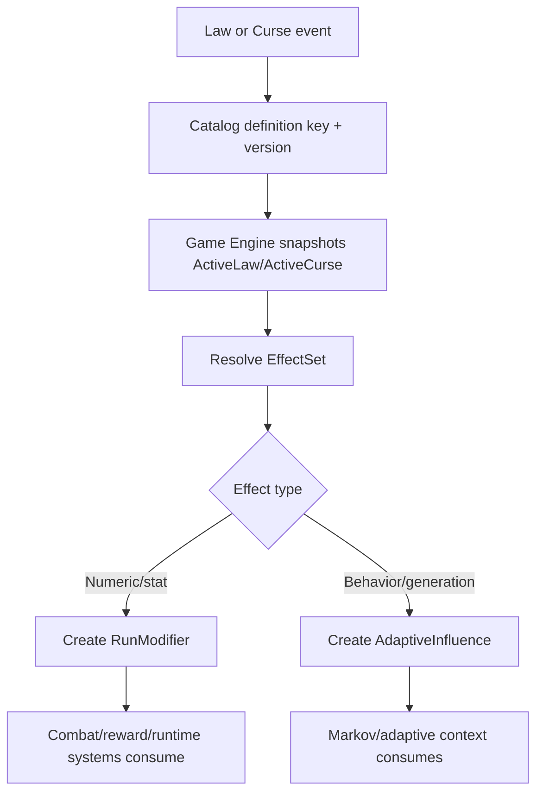

# 07 — Reward, item, law, curse model

Version: `data-model-0.1-rc2`

## Overview

Rewards, items, laws, and curses are defined in Catalog, materialized as runtime state in Game Engine, and may project permanent consequences to Player through outbox events.

## Effect source

EffectSet is the canonical Catalog source of effects. Reward options, item definitions, law definitions, curse definitions, and room special mechanics reference `effect_set_id` when they need gameplay effects. Per-entity effect tables are not part of data-model-0.1.

## Entity definitions

### RewardOffer

Owner: Game Engine. Created after combat victory, event resolution, merchant interaction, or other reward-producing events. Contains immutable `RewardOption` rows once offered.

### RewardOption

Owner: Game Engine runtime snapshot. Target term for choices inside an offer. Avoid `RewardChoice` in new schema except when referring to legacy/current code.

### RunItem

Owner: Game Engine. Runtime item snapshot acquired during a run. It is not a permanent inventory item.

### RunModifier

Owner: Game Engine. Runtime modifier created from EffectDefinitions. Applies to combat creation, reward generation, room selection, adaptive influence, or other runtime contexts.

### ActivePalaceLaw

Owner: Game Engine. Snapshot of an accepted Catalog law plus runtime expiration/consumption state.

### ActiveCurse

Owner: Game Engine. Snapshot of an applied Catalog curse plus runtime expiration/consumption state.

## RunItem snapshot

Catalog owns ItemDefinition. Game Engine owns the runtime item snapshot. A RunItem must remain stable even if Catalog changes after acquisition.

Minimum RunItem snapshot:

```text
definition_key
definition_version
narrative_text
item_type
category
rarity
usage_mode
lifecycle
quantity
max_stack
effect_set_key or effect_summary
is_usable_in_combat
is_usable_outside_combat
source_reward_option_id
acquired_at_utc
```

Permanent inventory and permanent unlocks belong to Player or a future dedicated service if that domain grows.

## Flow diagrams

### Reward -> Item/Modifier -> Runtime effect



### Law/Curse -> Modifier/Adaptive influence



## Examples

### Eclat de garde

```text
Catalog key:
item.consumable.eclat-de-garde

EffectSet:
AddStartingGuard +8, Flat, Additive, UntilRunEnds

Runtime:
RunItem snapshots display and effect summary at acquisition.
When used, Game Engine creates a RunModifier.
Next combat computes starting_guard from immutable character snapshot + active modifiers.
```

### Baume de memoire

```text
Catalog key:
item.consumable.baume-de-memoire

EffectSet:
HealVitality +25, Flat, Immediate

Runtime:
RunItem snapshots the item. When used in combat, Game Engine applies healing to runtime state and records future metrics.
```

### La Mefiance des Echos

```text
Catalog key:
law.threshold.mefiance-des-echos

EffectSet:
ModifyEnemyBehavior, BehaviorTag=behavior.paranoid, Value=0.15, UntilRoomEnds

Runtime:
ActivePalaceLaw is snapshotted.
Game Engine creates a runtime adaptive influence.
Future enemy AI and Markov/adaptive selection may consume the influence without exposing matrices.
```

### Souffle Lourd

```text
Catalog key:
curse.threshold.souffle-lourd

EffectSet:
ModifyDifficultyMultiplier +0.10, Flat, NextCombatOnly

Runtime:
ActiveCurse is snapshotted.
RunModifier is consumed after the next combat.
```

## Duration expiration rules

| Duration | Expires when | Behavior |
|----------|--------------|----------|
| `Immediate` | immediately after application | no persisted modifier |
| `CurrentCombat` | combat ends | combat effect removed |
| `NextCombatOnly` | next combat resolves | modifier consumed |
| `NextRewardOnly` | next reward offer resolves | modifier consumed |
| `UntilRoomEnds` | current room resolves | modifier consumed |
| `UntilRunEnds` | run terminal state | modifier archived with run |
| `PermanentCandidate` | successful run completion | outbox projection to Player |

## Stack policy rules

| Policy | Behavior |
|--------|----------|
| `None` | reject duplicate active instance |
| `Additive` | sum values |
| `HighestOnly` | keep highest value |
| `RefreshDuration` | keep value and refresh duration |
| `Replace` | replace active instance |
| `UniqueBySource` | one active instance per source key |

## Frontend note

Frontend may display local reward/item/law/curse feedback. It does not own effect truth. Backend runtime state and future official metrics are authoritative.
